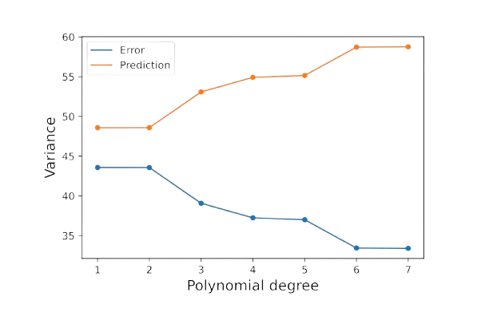
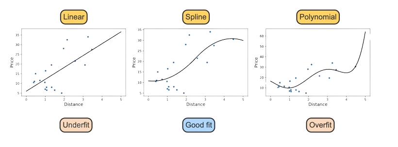
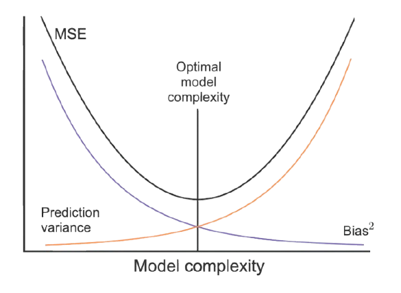

<!-- _backgroundImage: "url('../slides/title.png')" -->
<!-- _paginate: skip -->

# Machine Learning 

A Crash Course For Basics of AI

---

## Machine learning

Machine learning uses algorithms and models to make predictions and discover patterns in data. 

- A model is a mathematical function for describing the relationship between inputs and outputs and making predictions.
-  An algorithm is a procedure or set of decision rules used to carry out a machine learning task, such as making a prediction. 

Machine learning combines tools and theory from computer science, artificial intelligence, statistics, and mathematics to make predictions and apply knowledge to new data.

**Types of Machine Learning**

Three major areas of machine learning exist: supervised learning, unsupervised learning, and reinforcement learning.

- *Supervised learning* predicts a known output feature based on input features.
- *Unsupervised learning* describes patterns in a dataset without a known output feature.
- *Reinforcement learning* describes algorithms that make decisions and update based on the result of the previous decision.

---

## Features and Model Types

Features in a dataset may be categorical or numerical.

- A **categorical feature** has non-numerical values, or numerical values without mathematical meaning. Ex: Yes/no, address, type of customer (regular, occasional, new).
- A **numerical feature** has numerical values with mathematical meaning. Ex: Amount spent on a transaction, square footage of a house.
  
The actual values in a dataframe may not be enough to determine a feature's type—context matters. Ex: Phone numbers are numerical, but mathematical operations on phone numbers have no meaning. Thus, phone numbers are categorical features.

**Models**
- *Classification models* predict categorical outputs based on input features. Ex: Spam detection in emails.
- *Regression models* predict numerical outputs based on input features. Ex: Predicting house prices.
- *Unsupervised models* find patterns in data without known outputs.

  - *Clustering models* group similar instances. Ex: Customer segmentation.
  - *Outlier detection models* find unusual instances. Ex: Fraud detection.
  - *Dimension reduction* reduces dataset complexity by combining related features. Ex: Principal Component Analysis (PCA).

---

## Bias and Variance

The **prediction error** of an instance $i$ is the difference between the observed value, $y_i$, and the predicted value, $\hat{y}_i$. Prediction errors are also called residuals:  
$e_i = y_i - \hat{y}_i$.

- **Bias** is the mean prediction error:
  $$
  \text{Bias} = \frac{1}{n} \sum_{i=1}^n (e_i) = \bar{e}
  $$

- A model is **unbiased** when the mean difference between predicted and observed values is 0.  
  **Example:** Least squares regression guarantees 0 bias.

- **Causes of Bias**:
  - Poor model fitting.
  - Violated assumptions.
  - Systematic errors in data.

- **Variance** measures the spread of predictions:
  $$
  \text{Error variance} = \frac{1}{n} \sum_{i=1}^n (e_i - \bar{e})^2
  $$

- **Key Points**:
  - Low **bias** ensures predictions are close to the true value on average.
  - Low **variance** ensures predictions are stable across datasets.

- Models with low bias and low variance are ideal for accurate and consistent predictions.

---

## Error Variance vs. Prediction Variance

Two types of variance are often used in machine learning:

- **Error variance**: Variance of a model's prediction errors.
- **Prediction variance**: Variance of the predicted values, $\hat{y}_i$.

**Prediction variance** is calculated as:
$$
\text{Prediction variance} = \frac{1}{n} \sum_{i=1}^n (\hat{y}_i - \bar{\hat{y}}_i)^2
$$

Where $\bar{\hat{y}}_i$ is the mean predicted value.

- Models with **low error variance** often have **high prediction variance**.
- Predicted values $\hat{y}_i$ with low variance closely approximate the observed values, resulting in smaller errors.

<figcaption class="small-caption">

1. A polynomial model uses a polynomial function of the input features to predict the output feature.  **Example**: A third-degree polynomial is $y = w_0 + w_1x + w_2x^2 + w_3x^3$.  
2. Models with a higher degree are more complex and have lower error variance.  
3. Models with a higher degree also have more varied predictions. As error variance decreases, prediction variance increases.
</figcaption>

---

## Underfitting vs. Overfitting

A model is **underfitted** if the model is too simple to fit the data well. Underfitted models do not explain changes in the output feature sufficiently and will score poorly during model evaluation.  
A model is **overfitted** if the model is too complicated and fits the data too closely. Overfitted models do not generalize well to new data. A model that fits the general trend in the data without too much complexity is preferred.

<figcaption class="small-caption">

1. Consider three models for predicting price based on distance: a linear model, a spline model, and a polynomial model.  
2. The linear model fits the positive trend in the scatter plot but may be too simple. The linear model is likely underfitted.  
3. The spline model divides distance into smaller ranges and fits a separate curve within each range.  
4. The spline model is more complicated but fits the trend well. Using a spline model is a good balance between complexity and interpretability.  
5. The polynomial model is the most complex. The polynomial model is likely overfitted, since new data are unlikely to follow the same trend.
</figcaption>

**Key Takeaways**:
- **Underfitting**: The model is too simple to capture the trends in the data.  
  - Example: Linear model.  
- **Good Fit**: The model captures the general trends in the data without being overly complex.  
  - Example: Spline model.  
- **Overfitting**: The model is too complex and fits noise in the data rather than general trends.  
  - Example: Polynomial model.  

---

## Bias-Variance Tradeoff

**Mean squared error (MSE)** is the average of squared prediction errors:

$$
\text{MSE} = \frac{1}{n} \sum_{i=1}^n (y_i - \hat{y}_i)^2 = \frac{1}{n} \sum_{i=1}^n (e_i)^2
$$

MSE can be decomposed into **bias** and **prediction variance**:

$$
\text{MSE} = \text{Bias}^2 + \text{Prediction variance}
$$

Models with accurate predictions have low MSE. Bias and prediction variance are inversely related:
- **Complex models** have lower bias but higher prediction variance.
- An **optimal model** balances these two.

<figcaption class="small-caption">

1. As model complexity increases, prediction variance increases.  
2. As model complexity increases, bias decreases.  
3. An optimal model minimizes MSE by balancing bias and prediction variance.
</figcaption>

---

<!-- _backgroundImage: "url('../slides/title.png')" -->
<!-- _paginate: skip -->

# Classification Models

---

## K-Nearest Neighbors (KNN)

*knn is a supervised classification algorithm that predicts the class of an output feature based on the class of other instances with the most similar, or "nearest," input features.*

**k-nearest neighbors** is a supervised classification algorithm that predicts the class of an output feature based on the class of other instances with the most similar, or "nearest," input features. 

1. Identify the $k$ nearest instances using a distance measure.
2. Determine the class of each neighbor's output feature.
3. The most frequently occurring class among the $k$ closest instances becomes the prediction.

---

## k-Nearest Neighbors Algorithm

Let $\mathbf{x}_i = (x_{1i}, x_{2i}, \dots, x_{pi})$ denote the $p$ input features from instance $i$, and let $y_i$ denote the output feature.  
Let $n$ denote the number of instances in a dataset.  

A new instance $\mathbf{x}^*$ is classified in k-nearest neighbors by:
- Identifying the $k$-nearest instances to $\mathbf{x}^*$.
- Assigning the most common class among the neighbors as the prediction.

**k-nearest neighbors classification**

To classify a new instance, $\mathbf{x}^*$:
1. Select an integer value for $k$.  
2. Calculate the distance between $\mathbf{x}^*$ and all other $\mathbf{x}_i$ from $i = 1, \dots, n$.  
3. Sort the distances from smallest to largest and identify $i$ for the $k$ smallest distances.  
   The instances with the smallest distances to $\mathbf{x}^*$ are the nearest neighbors.  
4. Calculate the proportion of times each class occurs in the $k$ nearest neighbors.  
   These proportions represent the predicted probabilities of class membership.  
5. The predicted class for $\mathbf{x}^*$ is the class that occurs most often in the nearest neighbors.

---

## k-Nearest Neighbors Algorithm (cont.)

  

---

## Selecting an appropriate k

- You will learn the optimal value of $k$ by testing different values and evaluating the model's performance.

A **hyperparameter** is a user-defined setting in a machine learning model that is not estimated during model fitting. Changing the values of a hyperparameter affects the model's performance and predictions.

In **k-nearest neighbors**, the two main hyperparameters are:
1. The value of $k$ (number of neighbors).
2. The distance measure (e.g., Euclidean distance).

- **Impact of $k$**:
  - Setting $k$ too small leads to predictions based on very few instances, which makes the model highly variable.
  - Setting $k$ too large often results in underfitting because the model averages over many instances.
  
- **Practical Consideration**:
  - In practice, $k$ is typically set between 3 and 15 for most applications.

---

  

---

## Decision Boundaries

**What are Decision Boundaries?**  
Decision boundaries represent the dividing line (or surface) that separates one class from another in a classification problem. They determine how a machine learning model assigns labels to data points based on their input features.  

**Visualization**:  
- For one or two input features, decision boundaries can be visualized as lines or curves in a scatter plot.  
- When the number of input features $p > 2$, decision boundaries can be visualized using multiple scatter plots or projections.  

**Applications**:  
- Diagnose overfitting or underfitting by analyzing the complexity of boundaries.  
- Fine-tune hyperparameters to balance model complexity and generalization.

**Why are Decision Boundaries Important?**  
1. **Understanding Model Behavior**:
   - Interpret how a model predicts classes for different regions of the feature space.  

2. **Evaluating Model Strengths and Weaknesses**:
   - Highlight areas of good performance or ambiguity (e.g., overlapping classes).

3. **Comparing Models**:
   - Compare different models visually by analyzing the shape, flexibility, and generalization of their boundaries.

4. **Practical Use**:
   - Particularly useful in classification problems like spam detection, disease diagnosis, or fraud detection, where understanding the decision-making process is critical.

---

  

---

## Distance Measures in k-Nearest Neighbors

k-nearest neighbors classifies instances based on the $k$ closest instances.  
The choice of distance measure determines how neighbors are identified, which can affect results.

### Common Distance Measures:
1. **Euclidean Distance**:
   - Measures straight-line distance.  
   - Formula:  
     $$
     d_E(j, k) = \sqrt{\sum_{i=1}^p (x_{ij} - x_{ik})^2}
     $$

2. **Manhattan Distance**:
   - Also called "city block distance."  
   - Formula:  
     $$
     d_M(j, k) = \sum_{i=1}^p |x_{ij} - x_{ik}|
     $$

3. **Minkowski Distance**:
   - Generalizes both Euclidean and Manhattan distances with power $m$.  
   - Formula:  
     $$
     d_m(j, k) = \left(\sum_{i=1}^p |x_{ij} - x_{ik}|^m \right)^{1/m}
     $$

**Special Cases**:
- Minkowski distance with $m = 2$ is Euclidean distance.  
- Minkowski distance with $m = 1$ is Manhattan distance.  

---

  

---

## Advantages and Disadvantages of k-Nearest Neighbors

**Advantages**:  
- k-Nearest Neighbors (k-NN) is a flexible classification model that can predict multiple classes.  
- It relies on the most similar instances, making it straightforward and interpretable.

**Disadvantages**:  
- **Distance-based algorithms** only consider similarity between input features, not relationships between input and output.  
- k-NN cannot describe or quantify the relationship between input and output features.

**Sensitivity to Units and Magnitude**:  
- Distance-based algorithms like k-NN are sensitive to the scale of input features.  
  **Example**: The distance between the body mass of penguins depends on whether it is measured in grams or kilograms.  
- Input features should be **standardized** before using k-NN.

**Standardized Features**:  
- Features are scaled to have a mean of 0 and a standard deviation of 1.  
- Formula for standardization:  
  $$
  z = \frac{x - \bar{x}}{s}
  $$
- Standardized values are also referred to as **z-scores**.

