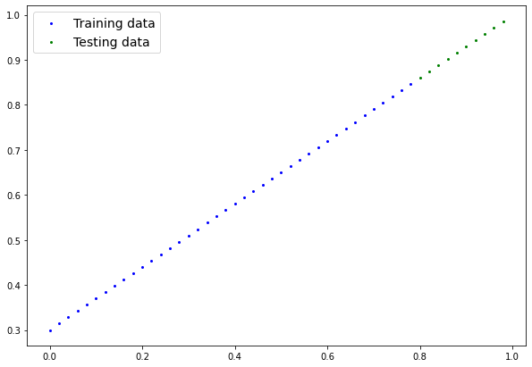
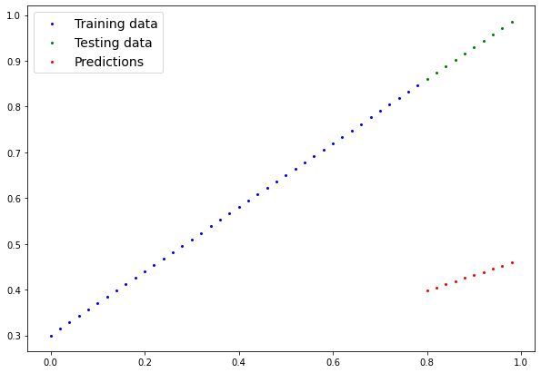
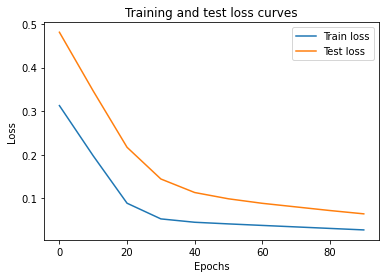
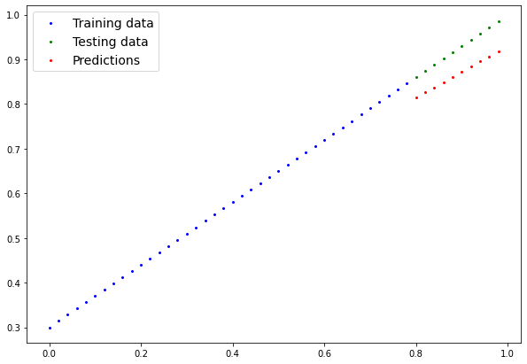

<!-- _backgroundImage: "url('../slides/title.png')" -->
<!-- _paginate: skip -->

# EAS510 Basic of AI

<span class="subtitle">Pytorch Work Flow</span>

<div class="course-info">
  <p>MoWeFr 2:00PM-2:50PM</p>
  <p>Norton 209</p>
  <p>Instructor: <strong>Jue Guo</strong></p>
  <p>01/22/2025 - 05/06/2025</p>
</div>

---

## Overview

The essence of machine learning and deep learning is to take some data from the past, build an algorithm (like a neural network) to discover patterns in it and use the discovered patterns to predict the future.

<div class="columns">
<div>

- There are many ways to do this and many new ways are being discovered all the time.
- How about we start with a straight line?
    - And we see if we can build a PyTorch model that learns the pattern of the straight line and matches it.
 


</div>

<div>

| Topic                       | Contents                                      |
|-----------------------------|-----------------------------------------------|
| **1. Data Preparation**     | Create a simple dataset (e.g., a straight line). |
| **2. Building a Model**     | Define the model, loss function, and optimizer. |
| **3. Training the Model**   | Fit the model to the training data.           |
| **4. Evaluating the Model** | Test the model on unseen data.                |
| **5. Saving/Loading Model** | Save and reuse the trained model.             |
| **6. Final Integration**    | Combine all steps into a complete pipeline.   |

---

<!-- _backgroundImage: "url('../slides/title.png')" -->
<!-- _paginate: skip -->
# 1. Data Preparation

---

## Data (Preparing and Loading)

I want to stress that "data" in machine learning can be almost anything you can imagine. A table of numbers (like a big Excel spreadsheet), images of any kind, videos (YouTube has lots of data!), audio files like songs or podcasts, protein structures, text and more.

<div class="columns">
<div>


</div>

<div>
Machine learning is a game of two parts:

1. Turn your data, whatever it is, into numbers (a representation).
2. Pick or build a model to learn the representation as best as possible.

Let's start with something simple by generating some pseudo data (*with a pattern of a straight line*) on our own. 

We'll use [linear regression](https://en.wikipedia.org/wiki/Linear_regression) to create the data with known **parameters** (things that can be learned by a model) and then we'll use PyTorch to see if we can build model to estimate these parameters using [**gradient descent**](https://en.wikipedia.org/wiki/Gradient_descent).

</div>
</div>

---

Let's start by creating a simple dataset (a straight line) using PyTorch.

<div class="columns">
<div>

```python
# Create *known* parameters
weight = 0.7
bias = 0.3

# Create data
start = 0
end = 1
step = 0.02
X = torch.arange(start, end, step).unsqueeze(dim=1)
y = weight * X + bias

X[:10], y[:10]
```

</div>

<div>

    (tensor([[0.0000],
            [0.0200],
            [0.0400],
            [0.0600],
            [0.0800],
            [0.1000],
            ...,
            [0.1800]]),
    tensor([[0.3000],
            [0.3140],
            [0.3280],
            [0.3420],
            [0.3560],
            ...,
            [0.4260]]))
</div>

---

## Training and Testing Data
One of most important steps in a machine learning project is creating a training and test set (and when required, a validation set).

<div class="columns">
<div>


| Split | Purpose | Amount of total data | How often is it used? |
| ----- | ----- | ----- | ----- |
| **Training set** | The model learns from this data (like the course materials you study during the semester). | ~60-80% | Always |
| **Validation set** | The model gets tuned on this data (like the practice exam you take before the final exam). | ~10-20% | Often but not always |
| **Testing set** | The model gets evaluated on this data to test what it has learned (like the final exam you take at the end of the semester). | ~10-20% | Always |

> **Note:** Always keep the test set separate from the training data. The model learns from training data and is evaluated on the test set to measure how well it **generalizes** to unseen examples.

</div>

<div>

```python
# Create train/test split
train_split = int(0.8 * len(X)) # 80% of data used for training set, 20% for testing 
X_train, y_train = X[:train_split], y[:train_split]
X_test, y_test = X[train_split:], y[train_split:]

len(X_train), len(y_train), len(X_test), len(y_test)
```

    (40, 40, 10, 10)

Wonderful, we've got 40 samples for training (`X_train` & `y_train`) and 10 samples for testing (`X_test` & `y_test`).

The model we create is going to try and learn the relationship between `X_train` & `y_train` and then we will evaluate what it learns on `X_test` and `y_test`.

---

<div class="center-img">
  
</div>

---

<!-- _backgroundImage: "url('../slides/title.png')" -->
<!-- _paginate: skip -->
# 2. Building a Model

---

## Building a Model

Now we've got some data, let's build a model to use the blue dots to predict the green dots.

```python
# Create a Linear Regression model class
class LinearRegressionModel(nn.Module): # <- almost everything in PyTorch is a nn.Module (think of this as neural network lego blocks)
    def __init__(self):
        super().__init__() 
        self.weights = nn.Parameter(torch.randn(1, # <- start with random weights (this will get adjusted as the model learns)
                                                dtype=torch.float), # <- PyTorch loves float32 by default
                                   requires_grad=True) # <- can we update this value with gradient descent?)

        self.bias = nn.Parameter(torch.randn(1, # <- start with random bias (this will get adjusted as the model learns)
                                            dtype=torch.float), # <- PyTorch loves float32 by default
                                requires_grad=True) # <- can we update this value with gradient descent?))

    # Forward defines the computation in the model
    def forward(self, x: torch.Tensor) -> torch.Tensor: # <- "x" is the input data (e.g. training/testing features)
        return self.weights * x + self.bias # <- this is the linear regression formula (y = m*x + b)
```

> **Resource:** We'll be using Python classes to create bits and pieces for building neural networks. If you're unfamiliar with Python class notation, I'd recommend reading [Real Python's Object Orientating programming in Python 3 guide](https://realpython.com/python3-object-oriented-programming/) a few times.

---

## PyTorch model building essentials


| PyTorch module | What does it do? |
| ----- | ----- |
| [`torch.nn`](https://pytorch.org/docs/stable/nn.html) | Contains all of the building blocks for computational graphs (essentially a series of computations executed in a particular way). |
| [`torch.nn.Parameter`](https://pytorch.org/docs/stable/generated/torch.nn.parameter.Parameter.html#parameter) | Stores tensors that can be used with `nn.Module`. If `requires_grad=True` gradients (used for updating model parameters via [**gradient descent**](https://ml-cheatsheet.readthedocs.io/en/latest/gradient_descent.html))  are calculated automatically, this is often referred to as "autograd".  | 
| [`torch.nn.Module`](https://pytorch.org/docs/stable/generated/torch.nn.Module.html#torch.nn.Module) | The base class for all neural network modules, all the building blocks for neural networks are subclasses. If you're building a neural network in PyTorch, your models should subclass `nn.Module`. Requires a `forward()` method be implemented. | 
| [`torch.optim`](https://pytorch.org/docs/stable/optim.html) | Contains various optimization algorithms (these tell the model parameters stored in `nn.Parameter` how to best change to improve gradient descent and in turn reduce the loss). | 
| `def forward()` | All `nn.Module` subclasses require a `forward()` method, this defines the computation that will take place on the data passed to the particular `nn.Module` (e.g. the linear regression formula above). |

If the above sounds complex, think of like this, almost everything in a PyTorch neural network comes from `torch.nn`,
* `nn.Module` contains the larger building blocks (layers)
* `nn.Parameter` contains the smaller parameters like weights and biases (put these together to make `nn.Module`(s))
* `forward()` tells the larger blocks how to make calculations on inputs (tensors full of data) within  `nn.Module`(s)
* `torch.optim` contains optimization methods on how to improve the parameters within `nn.Parameter` to better represent input data 

---

<div class="center-img">
  
</div>

Basic building blocks of creating a PyTorch model by subclassing `nn.Module`. For objects that subclass `nn.Module`, the `forward()` method must be defined.

> **Resource**: See more of these essential modules and their use cases in the [PyTorch Cheat Sheet](https://pytorch.org/tutorials/beginner/ptcheat.html).

---

## Checking the contents of a PyTorch model

Let's create a model instance with the class we've made and check its parameters using `.parameters()`.
<div class="columns">
<div>

```python
# Set manual seed since nn.Parameter are randomly initialized
torch.manual_seed(42)

# Create an instance of the model (this is a subclass of nn.Module that contains nn.Parameter(s))
model_0 = LinearRegressionModel()

# Check the nn.Parameter(s) within the nn.Module subclass we created
list(model_0.parameters())
```

    [Parameter containing:
    tensor([0.3367], requires_grad=True),
    Parameter containing:
    tensor([0.1288], requires_grad=True)]

</div>

<div>
We can also get the state (what the model contains) of the model using .state_dict().

```python
# List named parameters 
model_0.state_dict()
```

    OrderedDict([('weights', tensor([0.3367])),
                 ('bias', tensor([0.1288]))])

Notice how the values for weights and bias from `model_0.state_dict()` come out as random float tensors?

This is because we initialized them above using `torch.randn()`.

Essentially we want to start from random parameters and get the model to update them towards parameters that fit our data best (the hardcoded weight and bias values we set when creating our straight line data).

---

## Making Predictions using `torch.inference_mode()`

When we pass data to our model, it'll go through the model's `forward()` method and produce a result using the computation we've defined.

<div class="columns">
<div>
Let's make some predictions.

```python
# Make predictions with model
with torch.inference_mode(): 
    y_preds = model_0(X_test)

# Note: in older PyTorch code you might also see torch.no_grad()
# with torch.no_grad():
#   y_preds = model_0(X_test)
```

You probably noticed we used [`torch.inference_mode()`](https://pytorch.org/docs/stable/generated/torch.autograd.grad_mode.inference_mode.html) as a [context manager](https://realpython.com/python-with-statement/) to make the predictions.

`torch.inference_mode()` turns off a bunch of things (like gradient tracking, which is necessary for training but not for inference) to make **forward-passes** (data going through the `forward()` method) faster.

</div>
<div>

>Note: In older PyTorch code, you may also see `torch.no_grad()` being used for inference. While `torch.inference_mode()` and `torch.no_grad()` do similar things, `torch.inference_mode()` is newer, potentially faster and preferred. See this [Tweet from PyTorch](https://x.com/PyTorch/status/1437838231505096708?s=20) for more.

```python
# Check the predictions
print(f"Number of testing samples: {len(X_test)}") 
print(f"Number of predictions made: {len(y_preds)}")
print(f"Predicted values:\n{y_preds}")
```
    Number of testing samples: 10
    Number of predictions made: 10
    Predicted values:
    tensor([[0.3982],
            ...,
            [0.4318],
            [0.4588]])
</div>

---

Our predictions are still numbers on a page, let's visualize them with our `plot_predictions()` function we created above.

<div class="center-img">
  
</div>

Woah! Those predictions look bad... Our model is using random parameters and hasn't considered the blue dots. Time to change that.

---
<!-- _backgroundImage: "url('../slides/title.png')" -->
<!-- _paginate: skip -->
# 3. Training the Model
___

## Train model

Our model is currently making predictions using random parameters, essentially guessing. To improve this, we need to update its internal parameters (weights and bias) to better represent the data. While we could hard code these values, it's more practical and interesting to write code that allows the model to learn and determine the ideal parameters on its own.

**Creating a loss function and optimizer in PyTorch**

For our model to update its parameters on its own, we'll need to add a few more things to our recipe.

- And that's a loss function as well as an optimizer.

The rolls of these are:

| Function | What does it do? | Where does it live in PyTorch? | Common values |
| ----- | ----- | ----- | ----- |
| **Loss function** | Measures how wrong your model's predictions (e.g. `y_preds`) are compared to the truth labels (e.g. `y_test`). Lower the better. | PyTorch has plenty of built-in loss functions in [`torch.nn`](https://pytorch.org/docs/stable/nn.html#loss-functions). | Mean absolute error (MAE) for regression problems ([`torch.nn.L1Loss()`](https://pytorch.org/docs/stable/generated/torch.nn.L1Loss.html)). Binary cross entropy for binary classification problems ([`torch.nn.BCELoss()`](https://pytorch.org/docs/stable/generated/torch.nn.BCELoss.html)).  |
| **Optimizer** | Tells your model how to update its internal parameters to best lower the loss. | You can find various optimization function implementations in [`torch.optim`](https://pytorch.org/docs/stable/optim.html). | Stochastic gradient descent ([`torch.optim.SGD()`](https://pytorch.org/docs/stable/generated/torch.optim.SGD.html#torch.optim.SGD)). Adam optimizer ([`torch.optim.Adam()`](https://pytorch.org/docs/stable/generated/torch.optim.Adam.html#torch.optim.Adam)). | 


---

## Loss function and Optimizer

Common values that work well include the SGD (stochastic gradient descent) or Adam optimizer, and the MAE (mean absolute error) loss function for regression problems or binary cross entropy loss function for classification problems.

For our problem, since we're predicting a number, we'll use MAE (under `torch.nn.L1Loss()`) as our loss function. 


<div class="columns">
<div>

The loss function we are going to use is called [Mean Absolute Error (MAE)](https://en.wikipedia.org/wiki/Mean_absolute_error). 

- Mean absolute error (MAE, in PyTorch: `torch.nn.L1Loss`) measures the absolute difference between two points (predictions and labels) and then takes the mean across all examples.

MAE is calculated as:

$$
\text{MAE} = \frac{1}{n} \sum_{i=1}^{n} |y_i - \hat{y}_i|
$$

where:
- $n$ is the number of data points
- $y_i$ is the actual value
- $\hat{y}_i$ is the predicted value

</div>
<div>


</div>

---

## Loss function and Optimizer (continued)

We'll use SGD, `torch.optim.SGD(params, lr)` where:

* `params` are the model parameters to optimize (e.g., `weights` and `bias`).
* `lr` is the **learning rate** for updating parameters. Higher values mean larger updates, lower values mean smaller updates. Common starting values are `0.01`, `0.001`, `0.0001`. The learning rate is a **hyperparameter** and can be adjusted over time ([learning rate scheduling](https://pytorch.org/docs/stable/optim.html#how-to-adjust-learning-rate)).

<div class="columns">
<div>

```python
# Create the loss function
loss_fn = nn.L1Loss() # MAE loss is same as L1Loss

# Create the optimizer
optimizer = torch.optim.SGD(params=model_0.parameters(), # parameters of target model to optimize
                            lr=0.01) # learning rate (how much the optimizer should change parameters at each step, higher=more (less stable), lower=less (might take a long time))
```

</div>
<div>

**optimization loop**

- Woohoo! Now we've got a loss function and an optimizer, it's now time to create a **training loop** (and **testing loop**).

  - The training loop involves the model going through the training data and learning the relationships between the `features` and `labels`.

  - The testing loop involves going through the testing data and evaluating how good the patterns are that the model learned on the training data (the model never sees the testing data during training).

Each of these is called a "loop" because we want our model to look (loop through) at each sample in each dataset.

</div>

---

## PyTorch training loop

For the training loop, we'll build the following steps:

| Number | Step name | What does it do? | Code example |
| ----- | ----- | ----- | ----- |
| 1 | Forward pass | The model goes through all of the training data once, performing its `forward()` function calculations. | `model(x_train)` |
| 2 | Calculate the loss | The model's outputs (predictions) are compared to the ground truth and evaluated to see how wrong they are. | `loss = loss_fn(y_pred, y_train)` | 
| 3 | Zero gradients | The optimizers gradients are set to zero (they are accumulated by default) so they can be recalculated for the specific training step. | `optimizer.zero_grad()` |
| 4 | Perform backpropagation on the loss | Computes the gradient of the loss with respect for every model parameter to be updated  (each parameter with `requires_grad=True`). This is known as **backpropagation**, hence "backwards".  | `loss.backward()` |
| 5 | Update the optimizer (**gradient descent**) | Update the parameters with `requires_grad=True` with respect to the loss gradients in order to improve them. | `optimizer.step()` |

---

## PyTorch training loop (continued)

<div class = "center-img">
  
</div>

> **Note:** The steps above are flexible and can vary with experience. Some rules of thumb:
> * Calculate the loss (`loss = ...`) *before* backpropagation (`loss.backward()`).
> * Zero gradients (`optimizer.zero_grad()`) *before* computing gradients (`loss.backward()`).
> * Step the optimizer (`optimizer.step()`) *after* backpropagation (`loss.backward()`).

---

## Question? 

**Why do we need to zero the gradients in PyTorch?**

- In PyTorch, gradients are accumulated by default. This means that if you don't zero the gradients, the new gradients will be added to the existing ones, which can lead to incorrect updates. Zeroing the gradients ensures that you start fresh for each backward pass.

  1. **Accumulation of Gradients**: Gradients are accumulated (summed) into the `.grad` attribute of the parameters.
  2. **Incorrect Updates**: Without zeroing, the gradients from previous iterations would be included in the current iteration, leading to incorrect parameter updates.
  3. **Zeroing Gradients**: By calling `optimizer.zero_grad()`, you reset the gradients to zero before the backward pass, ensuring that only the gradients from the current iteration are used.

In short, zeroing the gradients ensures that you start fresh for each backward pass, preventing incorrect updates.

---

## PyTorch testing loop

<div class="columns">
<div>

As for the testing loop (evaluating our model), the typical steps include:

| Number | Step name | What does it do? | Code example |
| ----- | ----- | ----- | ----- |
| 1 | Forward pass | The model goes through all of the testing data once, performing its `forward()` function calculations. | `model(x_test)` |
| 2 | Calculate the loss | The model's outputs (predictions) are compared to the ground truth and evaluated to see how wrong they are. | `loss = loss_fn(y_pred, y_test)` | 
| 3 | Calulate evaluation metrics (optional) | Alongside the loss value you may want to calculate other evaluation metrics such as accuracy on the test set. | Custom functions |

</div>
<div>

Notice the testing loop doesn't contain performing backpropagation (`loss.backward()`) or stepping the optimizer (`optimizer.step()`), 
 - this is because no parameters in the model are being changed during testing, they've already been calculated. For testing, we're only interested in the output of the forward pass through the model.

--- 

## PyTorch testing loop (continued)

<div class="center-img">
  
</div>

---

## Putting it all together

Let's put all of the above together and train our model for 100 epochs (forward passes through the data) and we'll evaluate it every 10 epochs.

<div class = "columns">
<div>

```python
torch.manual_seed(42)

epochs = 100

train_loss_values = []
test_loss_values = []
epoch_count = []

for epoch in range(epochs):
    model_0.train() # Put model in training mode (this is the default state of a model)
    y_pred = model_0(X_train)
    loss = loss_fn(y_pred, y_train)
    optimizer.zero_grad()
    loss.backward()
    optimizer.step()

    model_0.eval() # Put the model in evaluation mode
```
</div>

<div>

``` python 
    with torch.inference_mode():
        test_pred = model_0(X_test)
        test_loss = loss_fn(test_pred, y_test.type(torch.float))

        if epoch % 10 == 0:
            epoch_count.append(epoch)
            train_loss_values.append(loss.detach().numpy())
            test_loss_values.append(test_loss.detach().numpy())
            print(f"Epoch: {epoch} | MAE Train Loss: {loss} | MAE Test Loss: {test_loss}")
```
</div>

---

Oh would you look at that! Looks like our loss is going down with every epoch, let's plot it to find out.

<div class = "columns">
<div>

    Epoch: 0 | MAE Train Loss: 0.31288138031959534 | MAE Test Loss: 0.48106518387794495 
    Epoch: 10 | MAE Train Loss: 0.1976713240146637 | MAE Test Loss: 0.3463551998138428 
    Epoch: 20 | MAE Train Loss: 0.08908725529909134 | MAE Test Loss: 0.21729660034179688 
    Epoch: 30 | MAE Train Loss: 0.053148526698350906 | MAE Test Loss: 0.14464017748832703 
    Epoch: 40 | MAE Train Loss: 0.04543796554207802 | MAE Test Loss: 0.11360953003168106 
    Epoch: 50 | MAE Train Loss: 0.04167863354086876 | MAE Test Loss: 0.09919948130846024 
    Epoch: 60 | MAE Train Loss: 0.03818932920694351 | MAE Test Loss: 0.08886633068323135 
    Epoch: 70 | MAE Train Loss: 0.03476089984178543 | MAE Test Loss: 0.0805937647819519 
    Epoch: 80 | MAE Train Loss: 0.03132382780313492 | MAE Test Loss: 0.07232122868299484 
    Epoch: 90 | MAE Train Loss: 0.02788739837706089 | MAE Test Loss: 0.06473556160926819 
</div>

<div>

```python
# Plot the loss curves
plt.plot(epoch_count, train_loss_values, label="Train loss")
plt.plot(epoch_count, test_loss_values, label="Test loss")
plt.title("Training and test loss curves")
plt.ylabel("Loss")
plt.xlabel("Epochs")
plt.legend();
```
<div class = "center-img">
  
</div>

--- 

**Question**: Why did the loss go down?

- The loss decreased because the optimizer adjusted the model's parameters (weights and bias) to better fit the data.

<div class="columns">
<div>

Let's check the model's `.state_dict()` to see how close the parameters are to the original values.
```python
# Find our model's learned parameters
print("The model learned the following values for weights and bias:")
print(model_0.state_dict())
print("\nAnd the original values for weights and bias are:")
print(f"weights: {weight}, bias: {bias}")
```
    The model learned the following values for weights and bias:
    OrderedDict([('weights', tensor([0.5784])), ('bias', tensor([0.3513]))])

    And the original values for weights and bias are:
    weights: 0.7, bias: 0.3

</div>

<div>

Our model got very close to calculating the exact original values for weight and bias (and it would probably get even closer if we trained it for longer)

- It'd likely never guess them perfectly (especially when using more complicated datasets) but that's okay, often you can do very cool things with a close approximation.

This is the whole idea of machine learning and deep learning, **there are some ideal values that describe our data** and rather than figuring them out by hand, **we can train a model to figure them out programmatically**.

---

<!-- _backgroundImage: "url('../slides/title.png')" -->
<!-- _paginate: skip -->
# 4. Making Predictions with a Trained PyTorch Model (inference)

---

## Making Predictions with a Trained PyTorch Model


Once you've trained a model, you'll likely want to make predictions with it.

We've already seen a glimpse of this in the training and testing code above, the steps to do it outside of the training/testing loop are similar.

<div class="columns">
<div>

There are three things to remember when making predictions (also called performing inference) with a PyTorch model:

1. Set the model in evaluation mode (`model.eval()`).
2. Make the predictions using the inference mode context manager (`with torch.inference_mode(): ...`).
3. All predictions should be made with objects on the same device (e.g. data and model on GPU only or data and model on CPU only).

>The first two items make sure all helpful calculations and settings PyTorch uses behind the scenes during training but aren't necessary for inference are turned off (this results in faster computation). And the third ensures that you won't run into cross-device errors.

</div>

<div>

```python
# 1. Set the model in evaluation mode
model_0.eval()

# 2. Setup the inference mode context manager
with torch.inference_mode():
  # 3. Make sure the calculations are done with the model and data on the same device
  # in our case, we haven't setup device-agnostic code yet so our data and model are
  # on the CPU by default.
  # model_0.to(device)
  # X_test = X_test.to(device)
  y_preds = model_0(X_test)
y_preds
```

---

<div class="center-img">
  
</div>

---
<!-- _backgroundImage: "url('../slides/title.png')" -->
<!-- _paginate: skip -->
# 5. Saving and loading a PyTorch model
---

## Saving a PyTorch model's `state_dict()`
For saving and loading models in PyTorch, there are three main methods you should be aware of (all of below have been taken from the [PyTorch saving and loading models guide](https://pytorch.org/tutorials/beginner/saving_loading_models.html#saving-loading-model-for-inference)):

<div class="columns">
<div>

| PyTorch method | What does it do? | 
| ----- | ----- |
| [`torch.save`](https://pytorch.org/docs/stable/torch.html?highlight=save#torch.save) | Saves a serialized object to disk using Python's [`pickle`](https://docs.python.org/3/library/pickle.html) utility. Models, tensors and various other Python objects like dictionaries can be saved using `torch.save`.  | 
| [`torch.load`](https://pytorch.org/docs/stable/torch.html?highlight=torch%20load#torch.load) | Uses `pickle`'s unpickling features to deserialize and load pickled Python object files (like models, tensors or dictionaries) into memory. You can also set which device to load the object to (CPU, GPU etc). |
| [`torch.nn.Module.load_state_dict`](https://pytorch.org/docs/stable/generated/torch.nn.Module.html?highlight=load_state_dict#torch.nn.Module.load_state_dict)| Loads a model's parameter dictionary (`model.state_dict()`) using a saved `state_dict()` object. | 

</div>

<div>

**Saving a PyTorch model's `state_dict()`**

- Let's see how we can do that in a few steps:

  1. We'll create a directory for saving models to called `models` using Python's `pathlib` module.
  2. We'll create a file path to save the model to.
  3. We'll call `torch.save(obj, f)` where `obj` is the target model's `state_dict()` and `f` is the filename of where to save the model.
  
>Note: It's common convention for PyTorch saved models or objects to end with `.pt` or `.pth`, like `saved_model_01.pth`.

</div>

---

## From Saving to Loading a PyTorch model

<div class="columns">
<div>

```python 
from pathlib import Path

# 1. Create models directory 
MODEL_PATH = Path("models")
MODEL_PATH.mkdir(parents=True, exist_ok=True)

# 2. Create model save path 
MODEL_NAME = "01_pytorch_workflow_model_0.pth"
MODEL_SAVE_PATH = MODEL_PATH / MODEL_NAME

# 3. Save the model state dict 
print(f"Saving model to: {MODEL_SAVE_PATH}")
torch.save(obj=model_0.state_dict(), # only saving the state_dict() only saves the models learned parameters
           f=MODEL_SAVE_PATH) 
```

we can now load it in using `torch.nn.Module.load_state_dict(torch.load(f))` where `f` is the filepath of our saved model `state_dict()`.
</div>

<div>

**Question** Why call `torch.load()` inside `torch.nn.Module.load_state_dict()`?

- Because we only saved the model's `state_dict()` which is a dictionary of learned parameters and not the entire model, we first have to load the `state_dict()` with `torch.load()` and then pass that `state_dict()` to a new instance of our model (which is a subclass of `nn.Module`).

**Question** Why not save the entire model?

- [Saving the entire model](https://pytorch.org/tutorials/beginner/saving_loading_models.html#save-load-entire-model) rather than just the `state_dict()` is more intuitive, however, to quote the PyTorch documentation: "_The disadvantage of this approach (saving the whole model) is that the serialized data is bound to the specific classes and the exact directory structure used when the model is saved..._"
Because of this, your code can break in various ways when used in other projects or after refactors.

</div>

---

Now to test our loaded model, let's perform inference with it (make predictions) on the test data.


```python
# 1. Put the loaded model into evaluation mode
loaded_model_0.eval()

# 2. Use the inference mode context manager to make predictions
with torch.inference_mode():
    loaded_model_preds = loaded_model_0(X_test) # perform a forward pass on the test data with the loaded model
```

And that is it; we've successfully saved and loaded a PyTorch model.


