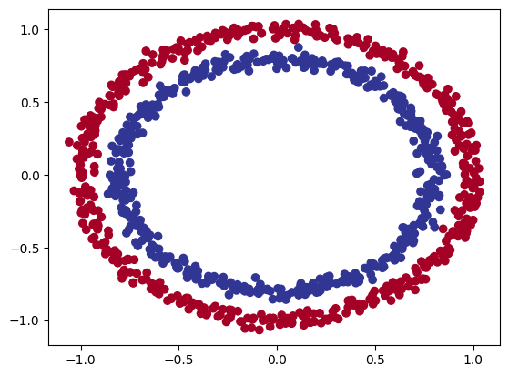
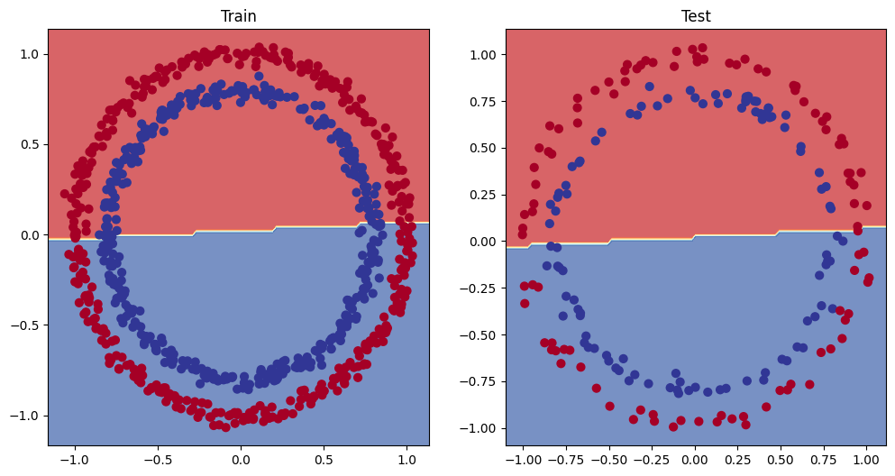
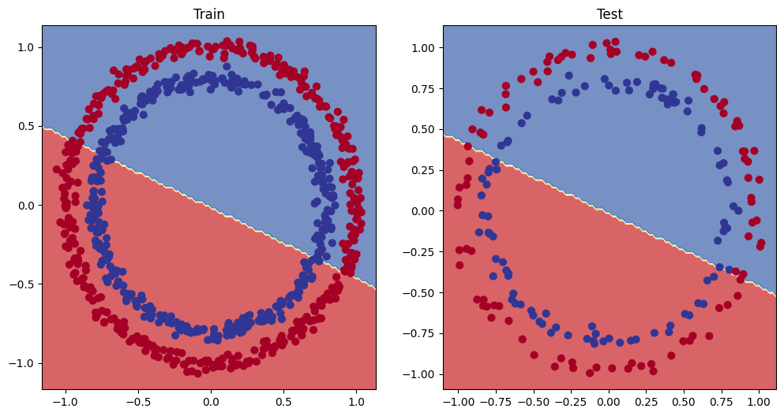
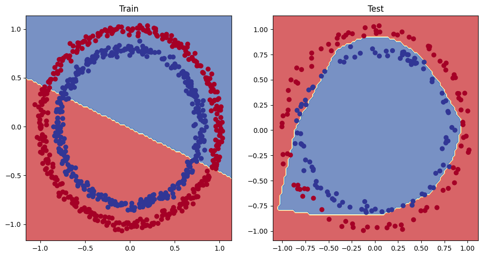
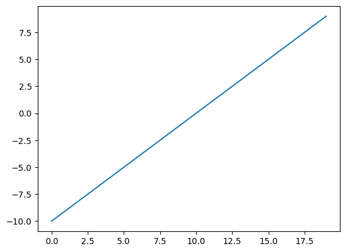
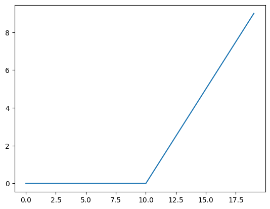
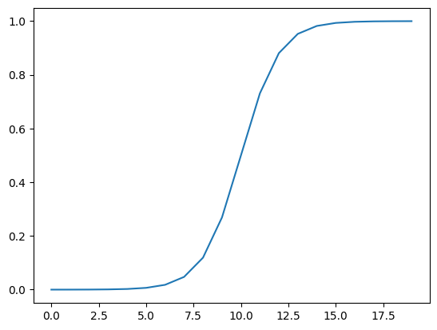
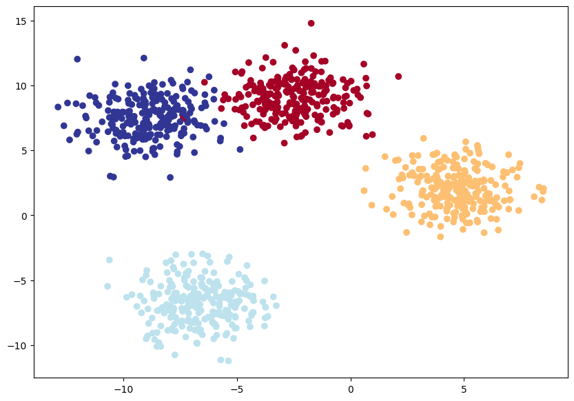
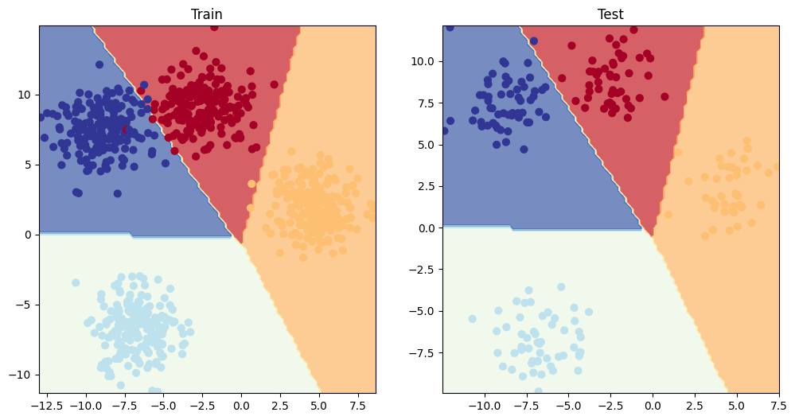

<!-- _backgroundImage: "url('../slides/title.png')" -->
<!-- _paginate: skip -->

# EAS510 Basic of AI

<span class="subtitle">PyTroch Neural Network Classification</span>

<div class="course-info">
  <p>MoWeFr 2:00PM-2:50PM</p>
  <p>Norton 209</p>
  <p>Instructor: <strong>Jue Guo</strong></p>
  <p>01/22/2025 - 05/06/2025</p>
</div>

---

## Table of Contents

- [What is a classification problem?](#what-is-a-classification-problem)
- [1. Getting classification data (Binary) ready](#1-getting-classification-data-binary-ready)
- [2. Building a model](#2-building-a-model)
- [3. Train model](#3-train-model)
- [4. Make predictions and evaluate the model](#4-make-predictions-and-evaluate-the-model)
- [5. Improving a model (from a model perspective)](#5-improving-a-model-from-a-model-perspective)
- [6. The missing piece: non-linearity](#6-the-missing-piece-non-linearity)
- [7. Replicating non-linear activation functions](#7-replicating-non-linear-activation-functions)

- [8. Putting things together by building a multi-class PyTorch model](#8-putting-things-together-by-building-a-multi-class-pytorch-model)


---

## Speed Q & A

<div class="columns">
<div>

### Project

1. **What are you being evaluated on?**
    - The final project evaluation is **exclusively** based on your deployed website. No separate written report is required beyond what you choose to show on the site (although you will have short in-class presentations for feedback and sharing)

2. **What should you include in your website**
    -  Data and Dataset Explanation (25%). 
    -  Methodology and Technical Approach (25%).
    -  Results & Analysis (30%). 
    -  Reproducibility and Code Accessibility (10%).

</div>

<div>

2. continue...
    -  Presentation Quality and Organization (10%). 
       - *A well-structured website is easier to navigate. Allocate separate pages or sections for data, method, results, and code instructions. Keep the design simple but professional, using visuals (plots, screenshots, or short videos) to enhance clarity. Although optional, interactive demos or short embedded videos can further engage readers.*

Since the website is the **sole** deliverable for the final evaluation, you are advised to continually update it with current findings, ensuring it remains accurate, organized, and self-contained.


---

## Speed Q & A (cont.)
<div class="columns">
<div>

### Course Logistics

1. **What is the best way to reach out to the instructor?**
    - Piazza & Office Hours

2. **What you should do before ask a question?**
    - Google it first
    - Check the course materials
    - Check the Piazza
    - Definitely check official documentations
3. **How do you get the 15pts bonus?**
   - Spend the weekends to finish certifications; if you **still** ask where is the certification, where is the link, I know you didn't read the syllabus.

</div>

<div>

**7 minutes to make some friends and be in a group :)**

---

<!-- _backgroundImage: "url('../slides/title.png')" -->
<!-- _paginate: skip -->
# What is a classification problem?

---


## What is a classification problem?

A [classification problem](https://en.wikipedia.org/wiki/Statistical_classification) involves predicting whether something is one thing or another.

<div class = "columns">
<div>

| Problem type | What is it? | Example |
| ----- | ----- | ----- |
| **Binary classification** | Target can be one of two options, e.g. yes or no | Predict whether or not someone has heart disease based on their health parameters. |
| **Multi-class classification** | Target can be one of more than two options | Decide whether a photo is of food, a person or a dog. |
| **Multi-label classification** | Target can be assigned more than one option | Predict what categories should be assigned to a Wikipedia article (e.g. mathematics, science & philosophy). |

</div>

<div>


</div>

---

## What we're going to cover


Except instead of trying to predict a straight line (predicting a number, also called a regression problem), we'll be working on a **classification problem**.

---

## What we're going to cover: an outline

| **Topic** | **Contents** |
| ----- | ----- |
| **0. Architecture of a classification neural network** | Neural networks can come in almost any shape or size, but they typically follow a similar floor plan. |
| **1. Getting binary classification data ready** | Data can be almost anything but to get started we're going to create a simple binary classification dataset. |
| **2. Building a PyTorch classification model** | Here we'll create a model to learn patterns in the data, we'll also choose a **loss function**, **optimizer** and build a **training loop** specific to classification. | 
| **3. Fitting the model to data (training)** | We've got data and a model, now let's let the model (try to) find patterns in the (**training**) data. |
| **4. Making predictions and evaluating a model (inference)** | Our model's found patterns in the data, let's compare its findings to the actual (**testing**) data. |
| **5. Improving a model (from a model perspective)** | We've trained and evaluated a model but it's not working, let's try a few things to improve it. |
| **6. Non-linearity** | So far our model has only had the ability to model straight lines, what about non-linear (non-straight) lines? |
| **7. Replicating non-linear functions** | We used **non-linear functions** to help model non-linear data, but what do these look like? |
| **8. Putting it all together with multi-class classification** | Let's put everything we've done so far for binary classification together with a multi-class classification problem. |

---

<!-- _backgroundImage: "url('../slides/title.png')" -->
<!-- _paginate: skip -->

# Architecture of a classification neural network

---

For the purpose of this course, we will simply provide you with the recipe for building a neural network instead of diving into the details of how it works.

| **Hyperparameter** | **Binary Classification** | **Multiclass classification** |
| --- | --- | --- |
| **Input layer shape** (`in_features`) | Same as number of features (e.g. 5 for age, sex, height, weight, smoking status in heart disease prediction) | Same as binary classification |
| **Hidden layer(s)** | Problem specific, minimum = 1, maximum = unlimited | Same as binary classification |
| **Neurons per hidden layer** | Problem specific, generally 10 to 512 | Same as binary classification |
| **Output layer shape** (`out_features`) | 1 (one class or the other) | 1 per class (e.g. 3 for food, person or dog photo) |
| **Hidden layer activation** | Usually [ReLU](https://pytorch.org/docs/stable/generated/torch.nn.ReLU.html#torch.nn.ReLU) (rectified linear unit) but [can be many others](https://en.wikipedia.org/wiki/Activation_function#Table_of_activation_functions) | Same as binary classification |
| **Output activation** | [Sigmoid](https://en.wikipedia.org/wiki/Sigmoid_function) ([`torch.sigmoid`](https://pytorch.org/docs/stable/generated/torch.sigmoid.html) in PyTorch)| [Softmax](https://en.wikipedia.org/wiki/Softmax_function) ([`torch.softmax`](https://pytorch.org/docs/stable/generated/torch.nn.Softmax.html) in PyTorch) |
| **Loss function** | [Binary crossentropy](https://en.wikipedia.org/wiki/Cross_entropy#Cross-entropy_loss_function_and_logistic_regression) ([`torch.nn.BCELoss`](https://pytorch.org/docs/stable/generated/torch.nn.BCELoss.html) in PyTorch) | Cross entropy ([`torch.nn.CrossEntropyLoss`](https://pytorch.org/docs/stable/generated/torch.nn.CrossEntropyLoss.html) in PyTorch) |
| **Optimizer** | [SGD](https://pytorch.org/docs/stable/generated/torch.optim.SGD.html) (stochastic gradient descent), [Adam](https://pytorch.org/docs/stable/generated/torch.optim.Adam.html) (see [`torch.optim`](https://pytorch.org/docs/stable/optim.html) for more options) | Same as binary classification |

---


<!-- _backgroundImage: "url('../slides/title.png')" -->
<!-- _paginate: skip -->

# 1. Getting classification data (Binary) ready

---

We'll use the `make_circles()` method from Scikit-Learn to generate two circles with different coloured dots.

<div class="columns">
<div>

```python
from sklearn.datasets import make_circles


# Make 1000 samples 
n_samples = 1000

# Create circles
X, y = make_circles(n_samples,
                    noise=0.03, # a little bit of noise to the dots
                    random_state=42) # keep random state so we get the same values
```
```python
print(f"First 5 X features:\n{X[:5]}")
print(f"\nFirst 5 y labels:\n{y[:5]}")
```
Looks like there  two features (`X`) and one labels (`y`).

</div>

<div>

```bash
First 5 X features:
[[ 0.75424625  0.23148074]
[-0.75615888  0.15325888]
[-0.81539193  0.17328203]
[-0.39373073  0.69288277]
[ 0.44220765 -0.89672343]]

First 5 y labels:
[1 1 1 1 0]
```

How many values of each class are there?

```python
# Check different labels
circles.label.value_counts()
```

```bash
label
1    500
0    500
Name: count, dtype: int64
```

</div>

---

### Visualizing the data 

<div class="columns">
<div>

```python 
# Visualize with a plot
import matplotlib.pyplot as plt
plt.scatter(x=X[:, 0], 
            y=X[:, 1], 
            c=y, 
            cmap=plt.cm.RdYlBu);
```
<div style="text-align: center;">
    
</div>

</div>

<div>

Alrighty, looks like we've got a problem to solve. 

Let's find out how we could build a PyTorch neural network to classify dots into red (0) or blue (1).

> Note: This dataset is often what's considered a toy problem (a problem that's used to try and test things out on) in machine learning.
> 
> But it represents the major key of classification, you have some kind of data represented as numerical values and you'd like to build a model that's able to classify it, in our case, separate it into red or blue dots.


---
## Input and output shapes
<div class="columns">
<div>


One of the most common errors in deep learning is shape errors. 

- Mismatching the shapes of tensors and tensor operations will result in errors in your models.
- And there's no surefire way to make sure they won't happen, they will. What you can do instead is continually familiarize yourself with the shape of the data you're working with.

To start with, always ask yourself: *"What shapes are my inputs and what shapes are my outputs?"*


```python 
# Check the shapes of our features and labels
X.shape, y.shape
```

```bash
((1000, 2), (1000,))
```

Looks like we've got a match on the first dimension of each.

- There's 1000 `X` and 1000 `y`.

But what's the second dimension on `X`?

</div>

<div>

It often helps to view the values and shapes of a single sample (features and labels).

Doing so will help you understand what input and output shapes you'd be expecting from your model.

```python
# View the first example of features and labels
X_sample = X[0]
y_sample = y[0]
print(f"Values for one sample of X: {X_sample} and the same for y: {y_sample}")
print(f"Shapes for one sample of X: {X_sample.shape} and the same for y: {y_sample.shape}")
```

```bash
Values for one sample of X: [0.75424625 0.23148074] and the same for y: 1
Shapes for one sample of X: (2,) and the same for y: ()
```


This tells us the second dimension for `X` means it has two features (vector) where as `y` has a single feature (scalar).
- *We have two inputs for one output.*

</div>

---

## Turn data into tensors and create train and test splits

<div class="columns">
<div>

Specifically, we'll need to:

  1. Turn our data into tensors (right now our data is in NumPy arrays and PyTorch prefers to work with PyTorch tensors).
  2. Split our data into training and test sets (we'll train a model on the training set to learn the patterns between `X` and `y` and then evaluate those learned patterns on the test dataset).

```python
# Turn data into tensors
# Otherwise this causes issues with computations later on
import torch
X = torch.from_numpy(X).type(torch.float)
y = torch.from_numpy(y).type(torch.float)

# View the first five samples
X[:5], y[:5]
```
```bash
(tensor([[ 0.7542,  0.2315],
        [-0.7562,  0.1533],
        [-0.8154,  0.1733],
        [-0.3937,  0.6929],
        [ 0.4422, -0.8967]]),
tensor([1., 1., 1., 1., 0.]))
```

</div>

<div>

Now our data is in tensor format, let's split it into training and test sets. To do so, let's use the helpful function `train_test_split()` from Scikit-Learn.
- We'll use `test_size=0.2` (80% training, 20% testing) and because the split happens randomly across the data, let's use `random_state=42` so the split is reproducible.

```python
# Split data into train and test sets
from sklearn.model_selection import train_test_split

X_train, X_test, y_train, y_test = train_test_split(X, 
                                                    y, 
                                                    test_size=0.2, # 20% test, 80% train
                                                    random_state=42) # make the random split reproducible

len(X_train), len(X_test), len(y_train), len(y_test)
```

    (800, 200, 800, 200)


Nice! Looks like we've now got 800 training samples and 200 testing samples.

</div>


---

<!-- _backgroundImage: "url('../slides/title.png')" -->
<!-- _paginate: skip -->

# 2. Building a model

---
 ## Building a PyTorch classification model

<div class="columns">
<div>

We've got some data ready, now it's time to build a model.

We'll break it down into a few parts.

1. Setting up device agnostic code (so our model can run on CPU or GPU if it's available).
2. Constructing a model by subclassing `nn.Module`.
3. Defining a loss function and optimizer.
4. Creating a training loop.

Let's start by importing PyTorch and `torch.nn` as well as setting up device agnostic code.

```python
# Standard PyTorch imports
import torch
from torch import nn

# Make device agnostic code
device = "cuda" if torch.cuda.is_available() else "cpu"
device
```
```bash
'cuda'
```

Now `device` is set up, we can use it for data or models, and PyTorch will handle it on the CPU or GPU if available.

</div>

<div>

We'll want a model capable of handling our `X` data as inputs and producing something in the shape of our `y` data as outputs.

- In other words, given `X` (features) we want our model to predict `y` (label).
- This setup where you have features and labels is referred to as **supervised learning**. Because your data is telling your model what the outputs should be given a certain input.

</div>

---

## Building a PyTorch classification model (cont.)

<div class="columns">
<div>

Let's create a model class that:

1. Subclasses `nn.Module` (almost all PyTorch models are subclasses of `nn.Module`).
2. Creates 2 `nn.Linear` layers in the constructor capable of handling the input and output shapes of `X` and `y`.
3. Defines a `forward()` method containing the forward pass computation of the model.
4. Instantiates the model class and sends it to the target `device`.

```python
# 1. Construct a model class that subclasses nn.Module
class CircleModelV0(nn.Module):
    def __init__(self):
        super().__init__()
        # 2. Create 2 nn.Linear layers capable of handling X and y input and output shapes
        self.layer_1 = nn.Linear(in_features=2, out_features=5) # takes in 2 features (X), produces 5 features
        self.layer_2 = nn.Linear(in_features=5, out_features=1) # takes in 5 features, produces 1 feature (y)
```

</div>

<div>

```python
    # 3. Define a forward method containing the forward pass computation
    def forward(self, x):
        # Return the output of layer_2, a single feature, the same shape as y
        return self.layer_2(self.layer_1(x)) # computation goes through layer_1 first then the output of layer_1 goes through layer_2

# 4. Create an instance of the model and send it to target device
model_0 = CircleModelV0().to(device)
model_0
```
```sh
CircleModelV0(
(layer_1): Linear(in_features=2, out_features=5, bias=True)
(layer_2): Linear(in_features=5, out_features=1, bias=True)
)
```

</div>

---

## Dive in a bit deeper

Let's refer to [PyTorch documentation](https://pytorch.org/docs/stable/generated/torch.nn.Linear.html) to understand what `nn.Linear` does.
<div class="columns">
<div>

From lateset PyTorch documentation, we can see that `nn.Linear` is a class that applies a linear transformation to the incoming data: $y = xA^T + b$.

- `classtorch.nn.Linear(in_features, out_features, bias=True, device=None, dtype=None)`

**Parameters**
- `in_features` (int) – size of each input sample

- `out_features` (int) – size of each output sample

- `bias` (bool) – If set to False, the layer will not learn an additive bias. Default: `True`

**Shape:**

- **Input:** $(*, H_{in})$ where $*$ means any number of dimensions including none, and $H_{in} = \text{in\_features}$.
- **Output:** $(*, H_{out})$ where all but the last dimension are the same shape as the input, and $H_{out} = \text{out\_features}$.

</div>
<div>

**Variables**

- **weight** *(torch.Tensor)* – the learnable weights of the module of shape  
  $(\text{out\_features}, \text{in\_features})$. The values are initialized from  
  $\mathcal{U}(-\sqrt{k}, \sqrt{k})$, where  

  $$
  k = \frac{1}{\text{in\_features}}
  $$

- **bias** – the learnable bias of the module of shape $(\text{out\_features})$.  
  If `bias` is `True`, the values are initialized from  
  $\mathcal{U}(-\sqrt{k}, \sqrt{k})$ where  

  $$
  k = \frac{1}{\text{in\_features}}
  $$

</div>

---
## Key Differences Between Uniform and Gaussian Distributions

| **Feature**        | **Uniform Distribution** $\mathcal{U}(a, b)$ | **Gaussian Distribution** $\mathcal{N}(\mu, \sigma^2)$ |
|--------------------|--------------------------------|----------------------------------|
| **Shape**         | Flat (constant probability)    | Bell-shaped (concentrated around mean) |
| **Probability**   | Equal for all values in $[a, b]$ | Higher near the mean, lower at extremes |
| **Mean** ($\mathbb{E}[X]$) | $\frac{a + b}{2}$ | $\mu$ (center of distribution) |
| **Variance** ($\text{Var}(X)$) | $\frac{(b - a)^2}{12}$ | $\sigma^2$ |
| **Typical Use Cases** | Random number generation, simple models | Real-world data modeling, neural network initialization |

---

## Back to the model

<div class="columns">
<div>

```python
# 1. Construct a model class that subclasses nn.Module
class CircleModelV0(nn.Module):
    def __init__(self):
        super().__init__()
        # 2. Create 2 nn.Linear layers capable of handling X and y input and output shapes
        self.layer_1 = nn.Linear(in_features=2, out_features=5) # takes in 2 features (X), produces 5 features
        self.layer_2 = nn.Linear(in_features=5, out_features=1) # takes in 5 features, produces 1 feature (y)
    
    # 3. Define a forward method containing the forward pass computation
    def forward(self, x):
        # Return the output of layer_2, a single feature, the same shape as y
        return self.layer_2(self.layer_1(x)) # computation goes through layer_1 first then the output of layer_1 goes through layer_2

# 4. Create an instance of the model and send it to target device
model_0 = CircleModelV0().to(device)
model_0
```
</div>
<div>

We've seen a few of these steps before.

- The only major change is what's happening between `self.layer_1` and `self.layer_2`.

- `self.layer_1` takes 2 input features `in_features=2` and produces 5 output features `out_features=5`. (*This is known as having 5 hidden units or neurons.*)

This allows the model to learn patterns from 5 numbers instead of 2, potentially leading to better outputs, though not always.

- The number of hidden units is a *hyperparameter* you can set. There's no fixed value; it depends on your model and dataset.

More units can be better, but too many can be detrimental. Choose based on your specific needs.
</div>

---

## Back to the model (cont.)

<div class="columns">
<div>

```python
# 1. Construct a model class that subclasses nn.Module
class CircleModelV0(nn.Module):
    def __init__(self):
        super().__init__()
        # 2. Create 2 nn.Linear layers capable of handling X and y input and output shapes
        self.layer_1 = nn.Linear(in_features=2, out_features=5) # takes in 2 features (X), produces 5 features
        self.layer_2 = nn.Linear(in_features=5, out_features=1) # takes in 5 features, produces 1 feature (y)
    
    # 3. Define a forward method containing the forward pass computation
    def forward(self, x):
        # Return the output of layer_2, a single feature, the same shape as y
        return self.layer_2(self.layer_1(x)) # computation goes through layer_1 first then the output of layer_1 goes through layer_2

# 4. Create an instance of the model and send it to target device
model_0 = CircleModelV0().to(device)
model_0
```
</div>

<div>

The only rule with hidden units is that the next layer, in our case, `self.layer_2`, has to take the same `in_features` as the previous layer's `out_features`.

- That's why `self.layer_2` has `in_features=5`; it takes the `out_features=5` from `self.layer_1` and performs a linear computation on them, turning them into `out_features=1` (the same shape as `y`).

Play with more example using [Tensor Playground](https://playground.tensorflow.org/#activation=tanh&batchSize=10&dataset=circle&regDataset=reg-plane&learningRate=0.03&regularizationRate=0&noise=0&networkShape=4,2&seed=0.40758&showTestData=false&discretize=false&percTrainData=50&x=true&y=true&xTimesY=false&xSquared=false&ySquared=false&cosX=false&sinX=false&cosY=false&sinY=false&collectStats=false&problem=classification&initZero=false&hideText=false)

<div style="text-align: center;">
  
</div>

</div>

---

## Other ways to create a model

<div class="columns">
<div>

```python
# 1. Construct a model class that subclasses nn.Module
class CircleModelV0(nn.Module):
    def __init__(self):
        super().__init__()
        # 2. Create 2 nn.Linear layers capable of handling X and y input and output shapes
        self.layer_1 = nn.Linear(in_features=2, out_features=5) # takes in 2 features (X), produces 5 features
        self.layer_2 = nn.Linear(in_features=5, out_features=1) # takes in 5 features, produces 1 feature (y)
    
    # 3. Define a forward method containing the forward pass computation
    def forward(self, x):
        # Return the output of layer_2, a single feature, the same shape as y
        return self.layer_2(self.layer_1(x)) # computation goes through layer_1 first then the output of layer_1 goes through layer_2

# 4. Create an instance of the model and send it to target device
model_0 = CircleModelV0().to(device)
model_0
```
</div>

<div>

`nn.Sequential` performs a forward pass computation of the input data through the layers in the order they appear.

```python
# Replicate CircleModelV0 with nn.Sequential
model_0 = nn.Sequential(
    nn.Linear(in_features=2, out_features=5),
    nn.Linear(in_features=5, out_features=1)
).to(device)

model_0
```

Woah, that looks much simpler than subclassing `nn.Module`. Why not just always use `nn.Sequential`?

- `nn.Sequential` is fantastic for straightforward computations. However, as the name suggests, it always runs layers in sequential order.

If you need more complex behavior (e.g., *branching*, *skipping layers*, or *other custom operations*), you'll want to define your own custom `nn.Module` subclass. This allows you to control the flow of data through the network beyond just sequential computation.

---

## Pass the data through the model (More issues we gotta fix!!!)

<div class="columns">
<div>

```python
# 1. Construct a model class that subclasses nn.Module
class CircleModelV0(nn.Module):
    def __init__(self):
        super().__init__()
        # 2. Create 2 nn.Linear layers capable of handling X and y input and output shapes
        self.layer_1 = nn.Linear(in_features=2, out_features=5) # takes in 2 features (X), produces 5 features
        self.layer_2 = nn.Linear(in_features=5, out_features=1) # takes in 5 features, produces 1 feature (y)
    
    # 3. Define a forward method containing the forward pass computation
    def forward(self, x):
        # Return the output of layer_2, a single feature, the same shape as y
        return self.layer_2(self.layer_1(x)) # computation goes through layer_1 first then the output of layer_1 goes through layer_2

# 4. Create an instance of the model and send it to target device
model_0 = CircleModelV0().to(device)
model_0
```
</div>

<div>

```python
# Make predictions with the model
untrained_preds = model_0(X_test.to(device))
print(f"Length of predictions: {len(untrained_preds)}, Shape: {untrained_preds.shape}")
print(f"Length of test samples: {len(y_test)}, Shape: {y_test.shape}")
print(f"\nFirst 10 predictions:\n{untrained_preds[:10]}")
print(f"\nFirst 10 test labels:\n{y_test[:10]}")
```
```sh
Length of predictions: 200, Shape: torch.Size([200, 1])
Length of test samples: 200, Shape: torch.Size([200])

First 10 predictions:
tensor([[0.0555],
        [0.0169],
        [0.2254],
        [0.0071],
        [0.3345],
        [0.3101],
        [0.1151],
        [0.1840],
        [0.2205],
        [0.0156]], device='cuda:0', grad_fn=<SliceBackward0>)

First 10 test labels:
tensor([1., 0., 1., 0., 1., 1., 0., 0., 1., 0.])
```

---


## Setup loss function and optimizer

Different problem types require different loss functions.

 - For example, for a regression problem (predicting a number) you might use mean absolute error (MAE) loss.

 - And for a binary classification problem (like ours), you'll often use binary cross entropy as the loss function.

However, the same optimizer function can often be used across different problem spaces.


| **Loss function/Optimizer** | **Problem type** | **PyTorch Code** |
|----------------------------|------------------|------------------|
| Stochastic Gradient Descent (SGD) optimizer | Classification, regression, many others. | `torch.optim.SGD()` |
| Adam Optimizer | Classification, regression, many others. | `torch.optim.Adam()` |
| Binary cross entropy loss | Binary classification | `torch.nn.BCELossWithLogits` or `torch.nn.BCELoss` |
| Cross entropy loss | Multi-class classification | `torch.nn.CrossEntropyLoss` |
| Mean absolute error (MAE) or L1 Loss | Regression | `torch.nn.L1Loss` |
| Mean squared error (MSE) or L2 Loss | Regression | `torch.nn.MSELoss` |

---

## Setup loss function and optimizer (cont.)


Since we're working with a binary classification problem, let's use a binary cross entropy loss function.


<div class="columns">
<div>

PyTorch has two binary cross entropy implementations:

1. `torch.nn.BCELoss()` - Creates a loss function that measures the binary cross entropy between the target (label) and input (features).
2. `torch.nn.BCEWithLogitsLoss()` - This is the same as above except it has a sigmoid layer (`nn.Sigmoid`) built-in (we'll see what this means soon).

Which one should you use?

- `torch.nn.BCEWithLogitsLoss()` is more numerically stable than `torch.nn.BCELoss()` with `nn.Sigmoid`.

- So, **implementation 2** is generally preferred. Advanced users may separate `nn.Sigmoid` and `torch.nn.BCELoss()`, but that's beyond this course's scope.

</div>

<div>

> **Note:** There's a [discussion on the PyTorch forums about the use of `nn.BCELoss` vs. `nn.BCEWithLogitsLoss`](https://discuss.pytorch.org/t/bceloss-vs-bcewithlogitsloss/33586/4). It can be confusing at first but as with many things, it becomes easier with practice.

With all this information, let's set up our loss function and optimizer.

```python
# Create a loss function
# loss_fn = nn.BCELoss() # BCELoss = no sigmoid built-in
loss_fn = nn.BCEWithLogitsLoss() # BCEWithLogitsLoss = sigmoid built-in

# Create an optimizer
optimizer = torch.optim.SGD(params=model_0.parameters(), 
                            lr=0.1)
```
</div>

---

## Setup loss function and optimizer (cont.)

We are not done yet, as we moving on with our course, we will add more components to the workflow until a advance level. 

<div class="columns">
<div>

Now let's also create an evaluation metric.

- **Evaluation Metric**: Measures how well a model performs, complementing the loss function, which measures how wrong it is.

**Why Use Evaluation Metrics?**  
- Offers a different perspective on model performance.  
- Helps analyze results from multiple viewpoints.  
- Commonly used in classification tasks.  

**Accuracy**  
Accuracy is calculated as:  

$$
\text{Accuracy} = \frac{\text{Correct Predictions}}{\text{Total Predictions}} \times 100
$$

For example, a model making 99 correct predictions out of 100 achieves **99% accuracy**.

</div>

<div>

```python
# Calculate accuracy (a classification metric)
def accuracy_fn(y_true, y_pred):
    correct = torch.eq(y_true, y_pred).sum().item() # torch.eq() calculates where two tensors are equal
    acc = (correct / len(y_pred)) * 100 
    return acc
```
Excellent! We can now use this function whilst training our model to measure it's performance alongside the loss.

See? We are getting professional with our workflow.
</div>

---

<!-- _backgroundImage: "url('../slides/title.png')" -->
<!-- _paginate: skip -->

# 3. Train model

---

## Converting Model Outputs to Predictions

Before doing anything complex; let's just see what our model has as of now; 

<div class="columns">
<div>

```python
# View the frist 5 outputs of the forward pass on the test data
y_logits = model_0(X_test.to(device))[:5]
y_logits
```
```sh
tensor([[-0.4279],
        [-0.3417],
        [-0.5975],
        [-0.3801],
        [-0.5078]], device='cuda:0', grad_fn=<SliceBackward0>)
```

Since our model hasn't been trained, these outputs are basically random. But *what* are they?

- They're the output of our `forward()` method,which implements two layers of `nn.Linear()` which internally calls the following equation:

$$
\mathbf{y} = x \cdot \mathbf{Weights}^T  + \mathbf{bias}
$$

The *raw outputs* (unmodified) of this equation ($\mathbf{y}$) and in turn, the raw outputs of our model are often referred to as [**logits**](https://datascience.stackexchange.com/a/31045).

</div>
<div>

However, these numbers are hard to interpret.We'd like some numbers that are comparable to our truth labels.

- To get our model's raw outputs (logits) into such a form, we can use the [sigmoid activation function](https://pytorch.org/docs/stable/generated/torch.sigmoid.html).

```python
# Use sigmoid on model logits
y_pred_probs = torch.sigmoid(y_logits)
y_pred_probs
```
```sh
tensor([[0.3946],
        [0.4154],
        [0.3549],
        [0.4061],
        [0.3757]], device='cuda:0', grad_fn=<SigmoidBackward0>)
```

For **binary classification**, model outputs (`y_pred_probs`) represent class probabilities:  
- `≥ 0.5` → **Class 1** (`y=1`)  
- `< 0.5` → **Class 0** (`y=0`)  

Convert probabilities to labels by rounding the **sigmoid activation** output.

</div>

---

## Converting Model Outputs to Predictions (cont.)

<div class="columns">
<div>

```python
# Use sigmoid on model logits
y_pred_probs = torch.sigmoid(y_logits)
y_pred_probs
```
```sh
tensor([[0.3946],
        [0.4154],
        [0.3549],
        [0.4061],
        [0.3757]], device='cuda:0', grad_fn=<SigmoidBackward0>)
```

For **binary classification**, model outputs (`y_pred_probs`) represent class probabilities:  
- `≥ 0.5` → **Class 1** (`y=1`)  
- `< 0.5` → **Class 0** (`y=0`)  

Convert probabilities to labels by rounding the **sigmoid activation** output.

</div>

<div>

```python
# Find the predicted labels (round the prediction probabilities)
y_preds = torch.round(y_pred_probs)

# In full
y_pred_labels = torch.round(torch.sigmoid(model_0(X_test.to(device))[:5]))

# Check for equality
print(torch.eq(y_preds.squeeze(), y_pred_labels.squeeze()))

# Get rid of extra dimension
y_preds.squeeze()

```
```sh
tensor([True, True, True, True, True], device='cuda:0')
tensor([1., 1., 1., 1., 1.], device='cuda:0', grad_fn=<SqueezeBackward0>)
```


Excellent! Now it looks like our model's predictions are in the same form as our truth labels (`y_test`).

```python
y_test[:5]
```
```sh
tensor([1., 0., 1., 0., 1.])
```
</div>

---

## Building a training and testing loop

Let's start by training for 100 epochs and outputing the model's progress every 10 epochs.

<div class="columns">
<div>

```python
torch.manual_seed(42)

epochs = 100

X_train, y_train = X_train.to(device), y_train.to(device)
X_test, y_test = X_test.to(device), y_test.to(device)

for epoch in range(epochs):
    model_0.train()

    y_logits = model_0(X_train).squeeze()
    y_pred = torch.round(torch.sigmoid(y_logits))

    loss = loss_fn(y_logits, y_train)
    acc = accuracy_fn(y_true=y_train, y_pred=y_pred)

    optimizer.zero_grad()
    loss.backward()
    optimizer.step()

    model_0.eval()
```
</div>
<div>

```python
    with torch.inference_mode():
        test_logits = model_0(X_test).squeeze()
        test_pred = torch.round(torch.sigmoid(test_logits))

        test_loss = loss_fn(test_logits, y_test)
        test_acc = accuracy_fn(y_true=y_test, y_pred=test_pred)

    if epoch % 10 == 0:
        print(f"Epoch: {epoch} | Loss: {loss:.5f}, Accuracy: {acc:.2f}% | Test loss: {test_loss:.5f}, Test acc: {test_acc:.2f}%")
```
```sh
Epoch: 0 | Loss: 0.70034, Accuracy: 50.00% | Test loss: 0.69484, Test acc: 52.50%
Epoch: 10 | Loss: 0.69718, Accuracy: 53.75% | Test loss: 0.69242, Test acc: 54.50%
Epoch: 20 | Loss: 0.69590, Accuracy: 51.12% | Test loss: 0.69161, Test acc: 53.50%
Epoch: 30 | Loss: 0.69530, Accuracy: 50.62% | Test loss: 0.69136, Test acc: 53.00%
Epoch: 40 | Loss: 0.69497, Accuracy: 49.75% | Test loss: 0.69131, Test acc: 53.50%
Epoch: 50 | Loss: 0.69474, Accuracy: 50.12% | Test loss: 0.69134, Test acc: 53.50%
...
```

</div>

---

## Building a training and testing loop (cont.)

Notice something from previous slides? 

<div class="columns">
<div>

```sh
Epoch: 0 | Loss: 0.70034, Accuracy: 50.00% | Test loss: 0.69484, Test acc: 52.50%
Epoch: 10 | Loss: 0.69718, Accuracy: 53.75% | Test loss: 0.69242, Test acc: 54.50%
Epoch: 20 | Loss: 0.69590, Accuracy: 51.12% | Test loss: 0.69161, Test acc: 53.50%
Epoch: 30 | Loss: 0.69530, Accuracy: 50.62% | Test loss: 0.69136, Test acc: 53.00%
Epoch: 40 | Loss: 0.69497, Accuracy: 49.75% | Test loss: 0.69131, Test acc: 53.50%
Epoch: 50 | Loss: 0.69474, Accuracy: 50.12% | Test loss: 0.69134, Test acc: 53.50%
Epoch: 60 | Loss: 0.69457, Accuracy: 49.88% | Test loss: 0.69139, Test acc: 53.50%
Epoch: 70 | Loss: 0.69442, Accuracy: 49.62% | Test loss: 0.69146, Test acc: 54.00%
Epoch: 80 | Loss: 0.69430, Accuracy: 49.62% | Test loss: 0.69153, Test acc: 54.50%
Epoch: 90 | Loss: 0.69418, Accuracy: 49.62% | Test loss: 0.69161, Test acc: 54.50%
```
</div>
<div>

The model completes training and testing, but accuracy remains around 50%, indicating no real learning.  

- Since this is a balanced binary classification problem (500 samples per class), the model performs no better than random guessing.

</div>

---

<!-- _backgroundImage: "url('../slides/title.png')" -->
<!-- _paginate: skip -->

# 4. Make predictions and evaluate the model

---

## Visualizing the model's predictions

<div class="center-img">
  
</div>


It's currently trying to split the red and blue dots using a straight line...

- That explains the 50% accuracy. Since our data is circular, drawing a straight line can at best cut it down the middle.

In machine learning terms, our model is **underfitting**, meaning it's not learning predictive patterns from the data.

---

<!-- _backgroundImage: "url('../slides/title.png')" -->
<!-- _paginate: skip -->

# 5. Improving a model (from a model perspective)

---

## Table of guidelines for improving a model

| Model improvement technique* | What does it do? |
| ----- | ----- |
| **Add more layers** | Each layer *potentially* increases the learning capabilities of the model with each layer being able to learn some kind of new pattern in the data. More layers are often referred to as making your neural network *deeper*. |
| **Add more hidden units** | Similar to the above, more hidden units per layer means a *potential* increase in learning capabilities of the model. More hidden units are often referred to as making your neural network *wider*. |
| **Fitting for longer (more epochs)** | Your model might learn more if it had more opportunities to look at the data. |
| **Changing the activation functions** | Some data just can't be fit with only straight lines (like what we've seen), using non-linear activation functions can help with this (hint, hint). |
| **Change the learning rate** | Less model specific, but still related, the learning rate of the optimizer decides how much a model should change its parameters each step, too much and the model overcorrects, too little and it doesn't learn enough. |
| **Change the loss function** | Again, less model specific but still important, different problems require different loss functions. For example, a binary cross entropy loss function won't work with a multi-class classification problem. |
| **Use transfer learning** | Take a pretrained model from a problem domain similar to yours and adjust it to your own problem.|

> Note: These adjustable values are called **hyperparameters**. Machine learning is part art, part science. There's no definitive best combination, so follow the data scientist's motto: "experiment, experiment, experiment".
---

## Improving a model (from a model perspective)

Let's see what happens if we add an extra layer to our model, fit for longer (`epochs=1000` instead of `epochs=100`) and increase the number of hidden units from `5` to `10`.

<div class="columns">
<div>

```python
class CircleModelV1(nn.Module):
    def __init__(self):
        super().__init__()
        self.layer_1 = nn.Linear(in_features=2, out_features=10)
        self.layer_2 = nn.Linear(in_features=10, out_features=10) # extra layer
        self.layer_3 = nn.Linear(in_features=10, out_features=1)
        
    def forward(self, x): # note: always make sure forward is spelt correctly!
        # Creating a model like this is the same as below, though below
        # generally benefits from speedups where possible.
        # z = self.layer_1(x)
        # z = self.layer_2(z)
        # z = self.layer_3(z)
        # return z
        return self.layer_3(self.layer_2(self.layer_1(x)))

model_1 = CircleModelV1().to(device)
model_1
```
</div>
<div>

```sh
CircleModelV1(
  (layer_1): Linear(in_features=2, out_features=10, bias=True)
  (layer_2): Linear(in_features=10, out_features=10, bias=True)
  (layer_3): Linear(in_features=10, out_features=1, bias=True)
)
```
Now we've got a model, we'll recreate a loss function and optimizer instance, using the same settings as before.

```python
# loss_fn = nn.BCELoss() # Requires sigmoid on input
loss_fn = nn.BCEWithLogitsLoss() # Does not require sigmoid on input
optimizer = torch.optim.SGD(model_1.parameters(), lr=0.1)
```
</div>

---

## Improving a model (from a model perspective) (cont.)

Beautiful, model, optimizer and loss function ready, let's make a training loop.

This time we'll train for longer (epochs=1000 vs epochs=100) and see if it improves our model.
<div class="columns">
<div>

```python
torch.manual_seed(42)

epochs = 1000 # Train for longer

# Put data to target device
X_train, y_train = X_train.to(device), y_train.to(device)
X_test, y_test = X_test.to(device), y_test.to(device)

for epoch in range(epochs):
    ### Training
    # 1. Forward pass
    y_logits = model_1(X_train).squeeze()
    y_pred = torch.round(torch.sigmoid(y_logits)) # logits -> prediction probabilities -> prediction labels

    # 2. Calculate loss/accuracy
    loss = loss_fn(y_logits, y_train)
    acc = accuracy_fn(y_true=y_train, 
                      y_pred=y_pred)

    # 3. Optimizer zero grad
    optimizer.zero_grad()
```
</div>
<div>

```python
    # 4. Loss backwards
    loss.backward()

    # 5. Optimizer step
    optimizer.step()

    ### Testing
    model_1.eval()
    with torch.inference_mode():
        # 1. Forward pass
        test_logits = model_1(X_test).squeeze() 
        test_pred = torch.round(torch.sigmoid(test_logits))
        # 2. Caculate loss/accuracy
        test_loss = loss_fn(test_logits,
                            y_test)
        test_acc = accuracy_fn(y_true=y_test,
                               y_pred=test_pred)

    # Print out what's happening every 10 epochs
    if epoch % 100 == 0:
        print(f"Epoch: {epoch} | Loss: {loss:.5f}, Accuracy: {acc:.2f}% | Test loss: {test_loss:.5f}, Test acc: {test_acc:.2f}%")
```
</div>

---

## Results of the our first attempt

<div class="columns">
<div>

```sh
Epoch: 0 | Loss: 0.69396, Accuracy: 50.88% | Test loss: 0.69261, Test acc: 51.00%
Epoch: 100 | Loss: 0.69305, Accuracy: 50.38% | Test loss: 0.69379, Test acc: 48.00%
Epoch: 200 | Loss: 0.69299, Accuracy: 51.12% | Test loss: 0.69437, Test acc: 46.00%
Epoch: 300 | Loss: 0.69298, Accuracy: 51.62% | Test loss: 0.69458, Test acc: 45.00%
Epoch: 400 | Loss: 0.69298, Accuracy: 51.12% | Test loss: 0.69465, Test acc: 46.00%
Epoch: 500 | Loss: 0.69298, Accuracy: 51.00% | Test loss: 0.69467, Test acc: 46.00%
Epoch: 600 | Loss: 0.69298, Accuracy: 51.00% | Test loss: 0.69468, Test acc: 46.00%
Epoch: 700 | Loss: 0.69298, Accuracy: 51.00% | Test loss: 0.69468, Test acc: 46.00%
Epoch: 800 | Loss: 0.69298, Accuracy: 51.00% | Test loss: 0.69468, Test acc: 46.00%
Epoch: 900 | Loss: 0.69298, Accuracy: 51.00% | Test loss: 0.69468, Test acc: 46.00%
```
What? Our model trained for longer and with an extra layer but it still looks like it didn't learn any patterns better than random guessing.

</div>
<div>


Let's visualize.

```python
# Plot decision boundaries for training and test sets
plt.figure(figsize=(12, 6))
plt.subplot(1, 2, 1)
plt.title("Train")
plot_decision_boundary(model_1, X_train, y_train)
plt.subplot(1, 2, 2)
plt.title("Test")
plot_decision_boundary(model_1, X_test, y_test)
```



---

## Preparing data to see if our model can model a straight line

Let's create some linear data to see if our model's able to model it and we're not just using a model that can't learn anything.

<div class="columns">
<div>

```python
# Create some data (same as notebook 01)
weight = 0.7
bias = 0.3
start = 0
end = 1
step = 0.01

# Create data
X_regression = torch.arange(start, end, step).unsqueeze(dim=1)
y_regression = weight * X_regression + bias # linear regression formula

# Check the data
print(len(X_regression))
X_regression[:5], y_regression[:5]
```
</div>
<div>

Wonderful! same thing; let's split the data into training and testing sets.

```python
# Create train and test splits
train_split = int(0.8 * len(X_regression)) # 80% of data used for training set
X_train_regression, y_train_regression = X_regression[:train_split], y_regression[:train_split]
X_test_regression, y_test_regression = X_regression[train_split:], y_regression[train_split:]

# Check the lengths of each split
print(len(X_train_regression), 
    len(y_train_regression), 
    len(X_test_regression), 
    len(y_test_regression))
```
</div>
</div>

Same old same old, it is just linear data, therefore, let's move on to check if our model can learn a straight line.

---

## Adjusting model_1 to fit a straight line

<div class="columns">
<div>

```python
# Same architecture as model_1 (but using nn.Sequential)
model_2 = nn.Sequential(
    nn.Linear(in_features=1, out_features=10),
    nn.Linear(in_features=10, out_features=10),
    nn.Linear(in_features=10, out_features=1)
).to(device)

model_2
```
```sh
Sequential(
  (0): Linear(in_features=1, out_features=10, bias=True)
  (1): Linear(in_features=10, out_features=10, bias=True)
  (2): Linear(in_features=10, out_features=1, bias=True)
)
```

We'll setup the loss function to be `nn.L1Loss()` (the same as mean absolute error) and the optimizer to be `torch.optim.SGD()`.

```python
# Loss and optimizer
loss_fn = nn.L1Loss()
optimizer = torch.optim.SGD(model_2.parameters(), lr=0.1)
```
</div>
<div>

Training function again ... You might think it is a bit repetitive ... 

```python
# Train the model
torch.manual_seed(42)

# Set the number of epochs
epochs = 1000

# Put data to target device
X_train_regression, y_train_regression = X_train_regression.to(device), y_train_regression.to(device)
X_test_regression, y_test_regression = X_test_regression.to(device), y_test_regression.to(device)

for epoch in range(epochs):
    ### Training 
    # 1. Forward pass
    y_pred = model_2(X_train_regression)
    
    # 2. Calculate loss (no accuracy since it's a regression problem, not classification)
    loss = loss_fn(y_pred, y_train_regression)
```

</div>

---

## Adjusting model_1 to fit a straight line (cont.)

<div class="columns">
<div>

```python
    # 3. Optimizer zero grad
    optimizer.zero_grad()

    # 4. Loss backwards
    loss.backward()

    # 5. Optimizer step
    optimizer.step()

    ### Testing
    model_2.eval()
    with torch.inference_mode():
      # 1. Forward pass
      test_pred = model_2(X_test_regression)
      # 2. Calculate the loss 
      test_loss = loss_fn(test_pred, y_test_regression)

    # Print out what's happening
    if epoch % 100 == 0: 
        print(f"Epoch: {epoch} | Train loss: {loss:.5f}, Test loss: {test_loss:.5f}")
```

</div>

<div>

```sh
Epoch: 0 | Train loss: 0.75986, Test loss: 0.54143
Epoch: 100 | Train loss: 0.09309, Test loss: 0.02901
Epoch: 200 | Train loss: 0.07376, Test loss: 0.02850
Epoch: 300 | Train loss: 0.06745, Test loss: 0.00615
Epoch: 400 | Train loss: 0.06107, Test loss: 0.02004
Epoch: 500 | Train loss: 0.05698, Test loss: 0.01061
Epoch: 600 | Train loss: 0.04857, Test loss: 0.01326
Epoch: 700 | Train loss: 0.06109, Test loss: 0.02127
Epoch: 800 | Train loss: 0.05599, Test loss: 0.01426
Epoch: 900 | Train loss: 0.05571, Test loss: 0.00603
```

Unlike `model_1`, `model_2`'s loss is decreasing.Our model performs better than random guessing on straight lines, indicating it has some learning capacity.

>Note: Start with a small neural network and dataset to ensure it works, then overfit on the small example before scaling up to reduce overfitting.

</div>
</div>

---

<!-- _backgroundImage: "url('../slides/title.png')" -->
<!-- _paginate: skip -->

# 6. The missing piece: non-linearity

---

## Building a model with non-linearity

What kind of pattern do you think you could draw with unlimited straight (linear) and non-straight (non-linear) lines?
- So far our neural networks have only been using linear (straight) line functions. But the data we've been working with is non-linear (circles).

What do you think will happen when we introduce the capability for our model to use **non-linear activation functions**?

<div class="columns">
<div>

PyTorch has a bunch of [ready-made non-linear activation functions](https://pytorch.org/docs/stable/nn.html#non-linear-activations-weighted-sum-nonlinearity) that do similar but different things. 

- One of the most common and best performing is [ReLU](https://en.wikipedia.org/wiki/Rectifier_(neural_networks)) (rectified linear-unit, [`torch.nn.ReLU()`](https://pytorch.org/docs/stable/generated/torch.nn.ReLU.html)).

```python
# Build model with non-linear activation function
from torch import nn
class CircleModelV2(nn.Module):
    def __init__(self):
        super().__init__()
        self.layer_1 = nn.Linear(in_features=2, out_features=10)
        self.layer_2 = nn.Linear(in_features=10, out_features=10)
        self.layer_3 = nn.Linear(in_features=10, out_features=1)
        self.relu = nn.ReLU() # <- add in ReLU activation function
```

</div>

<div>

```python
        # Can also put sigmoid in the model 
        # This would mean you don't need to use it on the predictions
        # self.sigmoid = nn.Sigmoid()

    def forward(self, x):
      # Intersperse the ReLU activation function between layers
       return self.layer_3(self.relu(self.layer_2(self.relu(self.layer_1(x)))))

model_3 = CircleModelV2().to(device)
print(model_3)
```
```sh
CircleModelV2(
  (layer_1): Linear(in_features=2, out_features=10, bias=True)
  (layer_2): Linear(in_features=10, out_features=10, bias=True)
  (layer_3): Linear(in_features=10, out_features=1, bias=True)
  (relu): ReLU()
)
```
</div>

---

## Rule of thumb for non-linearity

<div class="columns">
<div>


*A visual example of what a similar classification neural network to the one we've just built (using ReLU activation) looks like. Try creating one of your own on the [TensorFlow Playground website](https://playground.tensorflow.org/).*

</div>

<div>

> **Question:** *Where should I put the non-linear activation functions when constructing a neural network?*
>
> A rule of thumb is to put them in between hidden layers and just after the output layer, however, there is no set in stone option. As you learn more about neural networks and deep learning you'll find a bunch of different ways of putting things together. In the meantime, best to experiment, experiment, experiment.
</div>
</div>

---

## Training a model with non-linearity

<div class="columns">
<div>

```python
# Fit the model
torch.manual_seed(42)
epochs = 1000

# Put all data on target device
X_train, y_train = X_train.to(device), y_train.to(device)
X_test, y_test = X_test.to(device), y_test.to(device)

for epoch in range(epochs):
    # 1. Forward pass
    y_logits = model_3(X_train).squeeze()
    y_pred = torch.round(torch.sigmoid(y_logits)) # logits -> prediction probabilities -> prediction labels
    
    # 2. Calculate loss and accuracy
    loss = loss_fn(y_logits, y_train) # BCEWithLogitsLoss calculates loss using logits
    acc = accuracy_fn(y_true=y_train, 
                      y_pred=y_pred)
    
    # 3. Optimizer zero grad
    optimizer.zero_grad()

    # 4. Loss backward
    loss.backward()
```

</div>
<div>

```python
    # 5. Optimizer step
    optimizer.step()
    ### Testing
    model_3.eval()
    with torch.inference_mode():
      # 1. Forward pass
      test_logits = model_3(X_test).squeeze()
      test_pred = torch.round(torch.sigmoid(test_logits)) # logits -> prediction probabilities -> prediction labels
      # 2. Calculate loss and accuracy
      test_loss = loss_fn(test_logits, y_test)
      test_acc = accuracy_fn(y_true=y_test,
                             y_pred=test_pred)

    # Print out what's happening
    if epoch % 100 == 0:
        print(f"Epoch: {epoch} | Loss: {loss:.5f}, Accuracy: {acc:.2f}% | Test Loss: {test_loss:.5f}, Test Accuracy: {test_acc:.2f}%")
```
Ho ho! That's looking far better!
</div>
</div>

---

## Evaluating a model trained with non-linear activation functions

<div class="columns">
<div>

```python 
# Make predictions
model_3.eval()
with torch.inference_mode():
    y_preds = torch.round(torch.sigmoid(model_3(X_test))).squeeze()
y_preds[:10], y[:10] # want preds in same format as truth labels
```
```sh
(tensor([1., 0., 1., 0., 0., 1., 0., 0., 1., 0.], device='cuda:0'),
 tensor([1., 1., 1., 1., 0., 1., 1., 1., 1., 0.]))
```
```python 
# Plot decision boundaries for training and test sets
plt.figure(figsize=(12, 6))
plt.subplot(1, 2, 1)
plt.title("Train")
plot_decision_boundary(model_1, X_train, y_train) # model_1 = no non-linearity
plt.subplot(1, 2, 2)
plt.title("Test")
plot_decision_boundary(model_3, X_test, y_test) # model_3 = has non-linearity
```

</div>
<div>



</div>

---

<!-- _backgroundImage: "url('../slides/title.png')" -->
<!-- _paginate: skip -->

# 7. Replicating non-linear activation functions

---

## Replicating non-linear activation functions

We saw before how adding non-linear activation functions to our model can help it to model non-linear data.

> **Note:** Much of the data you'll encounter in the wild is non-linear (or a combination of linear and non-linear). Right now we've been working with dots on a 2D plot. But imagine if you had images of plants you'd like to classify, there's a lot of different plant shapes. Or text from Wikipedia you'd like to summarize, there's lots of different ways words can be put together (linear and non-linear patterns). 

<div class="columns">
<div>

```python
# Create a toy tensor (similar to the data going into our model(s))
A = torch.arange(-10, 10, 1, dtype=torch.float32)
A
```
```sh
tensor([-10.,  -9.,  -8.,  -7.,  -6.,  -5.,  -4.,  -3.,  -2.,  -1.,   0.,   1., 2.,   3.,   4.,   5.,   6.,   7.,   8.,   9.])
```
</div>

<div>



</div>

---

## Replicating non-linear activation functions (cont.)

<div class="columns">
<div>


A straight line, nice. Now let's see how the ReLU activation function influences it.

- And instead of using PyTorch's ReLU (`torch.nn.ReLU`), we'll recreate it ourselves.

The ReLU function turns all negatives to 0 and leaves the positive values as they are.
</div>

<div>

```python
# Create ReLU function by hand 
def relu(x):
  return torch.maximum(torch.tensor(0), x) # inputs must be tensors

# Pass toy tensor through ReLU function
relu(A)
```
```sh
tensor([0., 0., 0., 0., 0., 0., 0., 0., 0., 0., 0., 1., 2., 3., 4., 5., 6., 7., 8., 9.])
```

It looks like our ReLU function worked, all of the negative values are zeros.

<center>

</center>
</div>

---

## Replicating non-linear activation functions (cont.)

<div class="columns">
<div>

How about we try the [sigmoid function](https://en.wikipedia.org/wiki/Sigmoid_function) we've been using?

The sigmoid function formula goes like so:

$$ out_i = \frac{1}{1+e^{-input_i}} $$ 

Or using $x$ as input:

$$ S(x) = \frac{1}{1+e^{-x_i}} $$

Where $S$ stands for sigmoid, $e$ stands for [exponential](https://en.wikipedia.org/wiki/Exponential_function) ([`torch.exp()`](https://pytorch.org/docs/stable/generated/torch.exp.html)) and $i$ stands for a particular element in a tensor.

Let's build a function to replicate the sigmoid function with PyTorch.


```python
# Create a custom sigmoid function
def sigmoid(x):
  return 1 / (1 + torch.exp(-x))

# Test custom sigmoid on toy tensor
sigmoid(A)
```
</div>

<div>

```sh
tensor([4.5398e-05, 1.2339e-04, 3.3535e-04, 9.1105e-04, 2.4726e-03, 6.6929e-03, 1.7986e-02, 4.7426e-02, 1.1920e-01, 2.6894e-01, 5.0000e-01, 7.3106e-01, 8.8080e-01, 9.5257e-01, 9.8201e-01, 9.9331e-01, 9.9753e-01, 9.9909e-01, 9.9966e-01, 9.9988e-01])
```



</div>
</div>

---

<!-- _backgroundImage: "url('../slides/title.png')" -->
<!-- _paginate: skip -->
# 8. Putting things together by building a multi-class PyTorch model

---

## Multi-class classification overview

<div>

<div class="center-img">


<div class="small-caption" style="text-align: center;">

 Example of binary vs. multi-class classification. Binary deals with two classes (one thing or another), whereas multi-class classification can deal with any number of classes over two. For example, the popular ImageNet-1k dataset is used as a computer vision benchmark and has 1000 classes.</div>

</div>
</div>

---

## Creating multi-class classification data

Again, we will create some toy data to work with.

<div class="columns">
<div>

```python
# Import dependencies
import torch
import matplotlib.pyplot as plt
from sklearn.datasets import make_blobs
from sklearn.model_selection import train_test_split

# Set the hyperparameters for data creation
NUM_CLASSES = 4
NUM_FEATURES = 2
RANDOM_SEED = 42

# 1. Create multi-class data
X_blob, y_blob = make_blobs(n_samples=1000,
    n_features=NUM_FEATURES, # X features
    centers=NUM_CLASSES, # y labels 
    cluster_std=1.5, # give the clusters a little shake up (try changing this to 1.0, the default)
    random_state=RANDOM_SEED
)

# 2. Turn data into tensors
X_blob = torch.from_numpy(X_blob).type(torch.float)
y_blob = torch.from_numpy(y_blob).type(torch.LongTensor)
print(X_blob[:5], y_blob[:5])

```
</div>

<div>

```python
# 3. Split into train and test sets
X_blob_train, X_blob_test, y_blob_train, y_blob_test = train_test_split(X_blob,
    y_blob,
    test_size=0.2,
    random_state=RANDOM_SEED
)

# 4. Plot data
plt.figure(figsize=(10, 7))
plt.scatter(X_blob[:, 0], X_blob[:, 1], c=y_blob, cmap=plt.cm.RdYlBu);
```
<center>

</center>

</div>

---

## Building a multi-class classification model in PyTorch

<div class="columns">
<div>

Let's create a subclass of `nn.Module` that takes in three hyperparameters:

- `input_features` - the number of `X` features coming into the model.
- `output_features` - the ideal numbers of output features we'd like (this will be equivalent to `NUM_CLASSES` or the number of classes in your multi-class classification problem).
- `hidden_units` - the number of hidden neurons we'd like each hidden layer to use.

```python
from torch import nn

# Build model
class BlobModel(nn.Module):
    def __init__(self, input_features, output_features, hidden_units=8):


```

</div>

```python
        super().__init__()
        self.linear_layer_stack = nn.Sequential(
            nn.Linear(in_features=input_features, out_features=hidden_units),
            # nn.ReLU(), # <- does our dataset require non-linear layers? (try uncommenting and see if the results change)
            nn.Linear(in_features=hidden_units, out_features=hidden_units),
            # nn.ReLU(), # <- does our dataset require non-linear layers? (try uncommenting and see if the results change)
            nn.Linear(in_features=hidden_units, out_features=output_features), # how many classes are there?
        )
    
    def forward(self, x):
        return self.linear_layer_stack(x)

# Create an instance of BlobModel and send it to the target device
model_4 = BlobModel(input_features=NUM_FEATURES, 
                    output_features=NUM_CLASSES, 
                    hidden_units=8).to(device)
model_4

```
</div>

---

## Loss and Optimizer for multi-class classification

Since we're dealing with multi-class classification, we'll use the `nn.CrossEntropyLoss()` loss function. I love my bb.

<div class="columns">
<div>

```python
# Create loss and optimizer
loss_fn = nn.CrossEntropyLoss()
optimizer = torch.optim.SGD(model_4.parameters(), 
                            lr=0.1) # exercise: try changing the learning rate here and seeing what happens to the model's performance
```

**Getting prediction probabilities**

We've got a loss function and optimizer ready, and we're ready to train our model but before we do let's do a single forward pass with our model to see if it works.

```python
# Perform a single forward pass on the data (we'll need to put it to the target device for it to work)
model_4(X_blob_train.to(device))[:5]
```
```sh
tensor([[-1.2711, -0.6494, -1.4740, -0.7044],
        [ 0.2210, -1.5439,  0.0420,  1.1531],
        [ 2.8698,  0.9143,  3.3169,  1.4027],
        [ 1.9576,  0.3125,  2.2244,  1.1324],
        [ 0.5458, -1.2381,  0.4441,  1.1804]], device='cuda:0',
       grad_fn=<SliceBackward0>)
```

</div>

<div>

It looks like we get one value per feature of each sample.

- So right now our model is outputing logits but what if we wanted to figure out exactly which label is was giving the sample?

- As in, how do we go from `logits -> prediction probabilities -> prediction labels` just like we did with the binary classification problem? We can use the `torch.nn.functional.softmax` function.

```python
# Make prediction logits with model
y_logits = model_4(X_blob_test.to(device))

# Perform softmax calculation on logits across dimension 1 to get prediction probabilities
y_pred_probs = torch.softmax(y_logits, dim=1) 
print(y_logits[:5])
print(y_pred_probs[:5])
```

</div>

---

## Binary to Multi-class classification

<div class="columns">
<div>

```python
# Make prediction logits with model
y_logits = model_4(X_blob_test.to(device))

# Perform softmax calculation on logits across dimension 1 to get prediction probabilities
y_pred_probs = torch.softmax(y_logits, dim=1) 
print(y_logits[:5])
print(y_pred_probs[:5])
```
```sh
tensor([[-1.2549, -0.8112, -1.4795, -0.5696],
        [ 1.7168, -1.2270,  1.7367,  2.1010],
        [ 2.2400,  0.7714,  2.6020,  1.0107],
        [-0.7993, -0.3723, -0.9138, -0.5388],
        [-0.4332, -1.6117, -0.6891,  0.6852]], device='cuda:0',
       grad_fn=<SliceBackward0>)
tensor([[0.1872, 0.2918, 0.1495, 0.3715],
        [0.2824, 0.0149, 0.2881, 0.4147],
        [0.3380, 0.0778, 0.4854, 0.0989],
        [0.2118, 0.3246, 0.1889, 0.2748],
        [0.1945, 0.0598, 0.1506, 0.5951]], device='cuda:0',
       grad_fn=<SliceBackward0>)
```
The softmax outputs may look random (since the model is untrained), but each sample now sums to 1 (or very close).
</div>

<div>
We can check: 

```python
# Sum the first sample output of the softmax activation function 
torch.sum(y_pred_probs[0])
```
```sh
tensor(1., device='cuda:0', grad_fn=<SumBackward0>)
```
Prediction probabilities indicate how much the model thinks the input maps to each class, with the highest value's index being the predicted class.
- We can check which index has the highest value using `torch.argmax()`.

    ```python
    # Which class does the model think is *most* likely at the index 0 sample?
    print(y_pred_probs[0])
    print(torch.argmax(y_pred_probs[0]))
    ```
    ```sh
    tensor([0.1872, 0.2918, 0.1495, 0.3715], device='cuda:0',
        grad_fn=<SelectBackward0>)
    tensor(3, device='cuda:0')
    ```

`torch.argmax()` returns 3, predicting class 3 for the sample at index 0. This is random guessing with a 25% chance;

</div>

---

## Creating a training and testing loop for a multi-class PyTorch model

We've done many of these steps before so much of this will be practice.

- The only difference is that we'll be adjusting the steps to turn the model outputs (logits) to prediction probabilities (using the softmax activation function) and then to prediction labels (by taking the argmax of the output of the softmax activation function).

<div class="columns">
<div>

```python
# Fit the model
torch.manual_seed(42)

# Set number of epochs
epochs = 100

# Put data to target device
X_blob_train, y_blob_train = X_blob_train.to(device), y_blob_train.to(device)
X_blob_test, y_blob_test = X_blob_test.to(device), y_blob_test.to(device)

for epoch in range(epochs):
    ### Training
    model_4.train()
    y_logits = model_4(X_blob_train) # model outputs raw logits 
    y_pred = torch.softmax(y_logits, dim=1).argmax(dim=1) # go from logits -> prediction probabilities -> prediction labels
```
</div>

<div>

```python
    loss = loss_fn(y_logits, y_blob_train) 
    acc = accuracy_fn(y_true=y_blob_train,
                      y_pred=y_pred)
    optimizer.zero_grad()
    loss.backward()
    optimizer.step()

    model_4.eval()
    with torch.inference_mode():
      # 1. Forward pass
      test_logits = model_4(X_blob_test)
      test_pred = torch.softmax(test_logits, dim=1).argmax(dim=1)
      # 2. Calculate test loss and accuracy
      test_loss = loss_fn(test_logits, y_blob_test)
      test_acc = accuracy_fn(y_true=y_blob_test,
                             y_pred=test_pred)
    # Print out what's happening
    if epoch % 10 == 0:
        print(f"Epoch: {epoch} | Loss: {loss:.5f}, Acc: {acc:.2f}% | Test Loss: {test_loss:.5f}, Test Acc: {test_acc:.2f}%")
```

</div>

---

## Making and evaluating predictions with a PyTorch multi-class model

Let's look at the output from our model and see how it's performing.

<div class="columns">
<div>

```sh
Epoch: 0 | Loss: 1.04324, Acc: 65.50% | Test Loss: 0.57861, Test Acc: 95.50%
Epoch: 10 | Loss: 0.14398, Acc: 99.12% | Test Loss: 0.13037, Test Acc: 99.00%
Epoch: 20 | Loss: 0.08062, Acc: 99.12% | Test Loss: 0.07216, Test Acc: 99.50%
Epoch: 30 | Loss: 0.05924, Acc: 99.12% | Test Loss: 0.05133, Test Acc: 99.50%
Epoch: 40 | Loss: 0.04892, Acc: 99.00% | Test Loss: 0.04098, Test Acc: 99.50%
Epoch: 50 | Loss: 0.04295, Acc: 99.00% | Test Loss: 0.03486, Test Acc: 99.50%
Epoch: 60 | Loss: 0.03910, Acc: 99.00% | Test Loss: 0.03083, Test Acc: 99.50%
Epoch: 70 | Loss: 0.03643, Acc: 99.00% | Test Loss: 0.02799, Test Acc: 99.50%
Epoch: 80 | Loss: 0.03448, Acc: 99.00% | Test Loss: 0.02587, Test Acc: 99.50%
Epoch: 90 | Loss: 0.03300, Acc: 99.12% | Test Loss: 0.02423, Test Acc: 99.50%
```

It looks like our trained model is performing pretty well.

</div>

<div>

```python
# Make predictions
model_4.eval()
with torch.inference_mode():
    y_logits = model_4(X_blob_test)

# View the first 10 predictions
y_logits[:10]
```
```sh
tensor([[  4.3377,  10.3539, -14.8948,  -9.7642],
        [  5.0142, -12.0371,   3.3860,  10.6699],
        [ -5.5885, -13.3448,  20.9894,  12.7711],
        [  1.8400,   7.5599,  -8.6016,  -6.9942],
        [  8.0727,   3.2906, -14.5998,  -3.6186],
        [  5.5844, -14.9521,   5.0168,  13.2890],
        [ -5.9739, -10.1913,  18.8655,   9.9179],
        [  7.0755,  -0.7601,  -9.5531,   0.1736],
        [ -5.5918, -18.5990,  25.5309,  17.5799],
        [  7.3142,   0.7197, -11.2017,  -1.2011]], device='cuda:0')
```
Alright, looks like our model's predictions are still in logit form.

- Though to evaluate them, they'll have to be in the same form as our labels (`y_blob_test`) which are in integer form.

</div>

---

## Making and evaluating predictions with a PyTorch multi-class model (cont.)

<div class="columns">
<div>

Let's convert our model's prediction logits to prediction probabilities (using `torch.softmax()`) then to prediction labels (by taking the `argmax()` of each sample).

>Note: It's possible to skip the `torch.softmax()` function and go straight from `predicted logits -> predicted labels` by calling `torch.argmax()` directly on the logits.
>
>For example, `y_preds = torch.argmax(y_logits, dim=1)`, this saves a computation step (no `torch.softmax()`) but results in **no prediction probabilities** being available to use.

```python
# Make predictions, convert logits to probabilities and then to labels
y_pred_probs = torch.softmax(y_logits, dim=1)
y_preds = y_pred_probs.argmax(dim=1)

print(f"Predictions: {y_preds[:10]}\nLabels: {y_blob_test[:10]}")
print(f"Test accuracy: {accuracy_fn(y_true=y_blob_test, y_pred=y_preds)}%")
```
</div>

<div>

```sh
Predictions: tensor([1, 3, 2, 1, 0, 3, 2, 0, 2, 0], device='cuda:0')
Labels: tensor([1, 3, 2, 1, 0, 3, 2, 0, 2, 0], device='cuda:0')
Test accuracy: 99.5%
```

Nice! Our model predictions are now in the same form as our test labels.

<center>

</center>

</div>

<div>

---

## More classification metrics

| **Metric name/Evaluation method** | **Defintion** | **Code** |
| --- | --- | --- |
| Accuracy | Out of 100 predictions, how many does your model get correct? E.g. 95% accuracy means it gets 95/100 predictions correct. | [`torchmetrics.Accuracy()`](https://torchmetrics.readthedocs.io/en/stable/classification/accuracy.html#id3) or [`sklearn.metrics.accuracy_score()`](https://scikit-learn.org/stable/modules/generated/sklearn.metrics.accuracy_score.html) |
| Precision | Proportion of true positives over total number of samples. Higher precision leads to less false positives (model predicts 1 when it should've been 0). | [`torchmetrics.Precision()`](https://torchmetrics.readthedocs.io/en/stable/classification/precision.html#id4) or [`sklearn.metrics.precision_score()`](https://scikit-learn.org/stable/modules/generated/sklearn.metrics.precision_score.html) |
| Recall | Proportion of true positives over total number of true positives and false negatives (model predicts 0 when it should've been 1). Higher recall leads to less false negatives. | [`torchmetrics.Recall()`](https://torchmetrics.readthedocs.io/en/stable/classification/recall.html#id5) or [`sklearn.metrics.recall_score()`](https://scikit-learn.org/stable/modules/generated/sklearn.metrics.recall_score.html) |
| F1-score | Combines precision and recall into one metric. 1 is best, 0 is worst. | [`torchmetrics.F1Score()`](https://torchmetrics.readthedocs.io/en/stable/classification/f1_score.html#f1score) or [`sklearn.metrics.f1_score()`](https://scikit-learn.org/stable/modules/generated/sklearn.metrics.f1_score.html) |
| [Confusion matrix](https://www.dataschool.io/simple-guide-to-confusion-matrix-terminology/)  | Compares the predicted values with the true values in a tabular way, if 100% correct, all values in the matrix will be top left to bottom right (diagnol line). | [`torchmetrics.ConfusionMatrix`](https://torchmetrics.readthedocs.io/en/stable/classification/confusion_matrix.html#confusionmatrix) or [`sklearn.metrics.plot_confusion_matrix()`](https://scikit-learn.org/stable/modules/generated/sklearn.metrics.ConfusionMatrixDisplay.html#sklearn.metrics.ConfusionMatrixDisplay.from_predictions) |
| Classification report | Collection of some of the main classification metrics such as precision, recall and f1-score. | [`sklearn.metrics.classification_report()`](https://scikit-learn.org/stable/modules/generated/sklearn.metrics.classification_report.html) |

Scikit-Learn (a popular and world-class machine learning library) has many implementations of the above metrics and you're looking for a PyTorch-like version, check out [TorchMetrics](https://torchmetrics.readthedocs.io/en/latest/), especially the [TorchMetrics classification section](https://torchmetrics.readthedocs.io/en/stable/pages/classification.html). 


   


