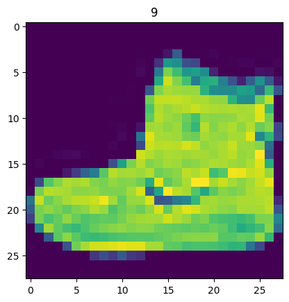
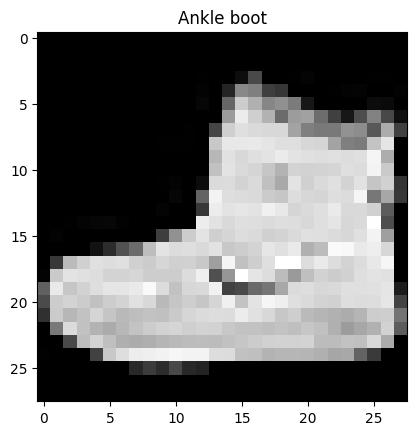
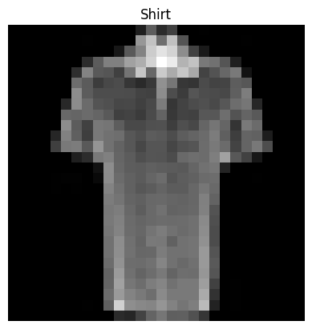

<!-- _backgroundImage: "url('../slides/title.png')" -->
<!-- _paginate: skip -->

# EAS510 Basic of AI

<span class="subtitle">PyTroch Computer Vision</span>

<div class="course-info">
  <p>MoWeFr 2:00PM-2:50PM</p>
  <p>Norton 209</p>
  <p>Instructor: <strong>Jue Guo</strong></p>
  <p>01/22/2025 - 05/06/2025</p>
</div>

---
## Table of Contents


---

## Computer Vision Overview

<div class = "columns">
<div>

[Computer vision](https://en.wikipedia.org/wiki/Computer_vision) is teaching a computer to see. It includes tasks like:

- [Binary classification](https://developers.google.com/machine-learning/glossary#binary-classification): Classifying a photo as a cat or dog.
- [Multi-class classification](https://developers.google.com/machine-learning/glossary#multi-class-classification): Classifying a photo as a cat, dog, or chicken.
- [Object detection](https://en.wikipedia.org/wiki/Object_detection): Identifying where a car appears in a video frame.
- [Panoptic segmentation](https://arxiv.org/abs/1801.00868): Separating different objects in an image.

<center>
</center>

</div>

<div>

**Where does computer vision get used?**

Computer vision is widely used in everyday life:

- Smartphones use it to enhance and sort images.
- Modern cars use it to avoid obstacles and stay in lanes.
- Manufacturers use it to identify product defects.
- Security cameras use it to detect intruders.

Anything visual can be a computer vision problem.


</div>
</div>

---

## What are we covering? 

## What are we covering?

| **Topic** | **Contents** |
| ----- | ----- |
| **0. CV libraries in PyTorch** | Explore PyTorch's built-in computer vision libraries. |
| **1. Load data** | Use FashionMNIST images for practice. |
| **2. Prepare data** | Load images with a PyTorch `DataLoader`. |
| **3. Model 0** | Build a baseline multi-class classification model. |
| **4. Evaluate model 0** | Make predictions and evaluate the baseline model. |
| **5. Device agnostic code** | Set up device-agnostic code. |
| **6. Model 1** | Improve the baseline model with non-linear layers. |
| **7. Model 2** | Introduce a Convolutional Neural Network (CNN). |
| **8. Compare models** | Compare the three models. |
| **9. Evaluate best model** | Make predictions and evaluate the best model. |
| **10. Confusion matrix** | Create a confusion matrix for evaluation. |
| **11. Save/load model** | Save and load the best performing model. |

---

## PyTorch Computer Vision Libraries

| PyTorch module | What does it do? |
| ----- | ----- |
| [`torchvision`](https://pytorch.org/vision/stable/index.html) | Contains datasets, model architectures and image transformations often used for computer vision problems. |
| [`torchvision.datasets`](https://pytorch.org/vision/stable/datasets.html) | Here you'll find many example computer vision datasets for a range of problems from image classification, object detection, image captioning, video classification and more. It also contains [a series of base classes for making custom datasets](https://pytorch.org/vision/stable/datasets.html#base-classes-for-custom-datasets). |
| [`torchvision.models`](https://pytorch.org/vision/stable/models.html) | This module contains well-performing and commonly used computer vision model architectures implemented in PyTorch, you can use these with your own problems. |
| [`torchvision.transforms`](https://pytorch.org/vision/stable/transforms.html) | Often images need to be transformed (turned into numbers/processed/augmented) before being used with a model, common image transformations are found here. |
| [`torch.utils.data.Dataset`](https://pytorch.org/docs/stable/data.html#torch.utils.data.Dataset) | Base dataset class for PyTorch.  |
| [`torch.utils.data.DataLoader`](https://pytorch.org/docs/stable/data.html#module-torch.utils.data) | Creates a Python iterable over a dataset (created with `torch.utils.data.Dataset`). |

> Note: The `torch.utils.data.Dataset` and `torch.utils.data.DataLoader` classes aren't only for computer vision in PyTorch, they are capable of dealing with many different types of data.

---

## PyTorch Computer Vision Libraries (cont.)

Let's see how do we import them.

```python
# Import PyTorch
import torch
from torch import nn

# Import torchvision 
import torchvision
from torchvision import datasets
from torchvision.transforms import ToTensor

# Import matplotlib for visualization
import matplotlib.pyplot as plt

# Check versions
# Note: your PyTorch version shouldn't be lower than 1.10.0 and torchvision version shouldn't be lower than 0.11
print(f"PyTorch version: {torch.__version__}\ntorchvision version: {torchvision.__version__}")
```

---

<!-- _backgroundImage: "url('../slides/title.png')" -->
<!-- _paginate: skip -->

# 1. Get a dataset

---

## FashionMNIST Dataset

<div class="columns">
<div>

To begin working on a computer vision problem, we'll start with the FashionMNIST dataset, which contains grayscale images of 10 different kinds of clothing. This dataset is similar to the original MNIST dataset but focuses on clothing items instead of handwritten digits.

FashionMNIST is available in `torchvision.datasets`, and we can download it using the `torchvision.datasets.FashionMNIST()` function with the following parameters:
- `root`: the folder to download the data to
- `train`: whether to download the training or test split
- `download`: whether to download the data
- `transform`: transformations to apply to the data
- `target_transform`: transformations to apply to the labels

We'll later build a computer vision neural network to identify different styles of clothing in these images.
</div>

<div>


  <div class = "small-caption">

  *`torchvision.datasets` contains a lot of example datasets you can use to practice writing computer vision code on. FashionMNIST is one of those datasets. And since it has 10 different image classes (different types of clothing), it's a multi-class classification problem.*
  </div>

</div>

---

## Input and output shapes of a computer vision model

<div class="columns">
<div>

```python
# Setup training data
train_data = datasets.FashionMNIST(
    root="data", # where to download data to?
    train=True, # get training data
    download=True, # download data if it doesn't exist on disk
    transform=ToTensor(), # images come as PIL format, we want to turn into Torch tensors
    target_transform=None # you can transform labels as well
)

# Setup testing data
test_data = datasets.FashionMNIST(
    root="data",
    train=False, # get test data
    download=True,
    transform=ToTensor()
)
```

How do you check the first sample of the training data?

```python
# See first training sample
image, label = train_data[0]
image, label
```
</div>

<div>
Again, we need to familiarize ourselves with the data;

```python
# What's the shape of the image?
image.shape
```
```sh
torch.Size([1, 28, 28])
```

The shape of the image tensor is `[1, 28, 28]` or more specifically:

```sh
[color_channels=1, height=28, width=28]
```

Having `color_channels=1` means the image is grayscale, if `color_channels=3`, the image comes in pixel values for red, green and blue (this is also known as the [RGB color model](https://en.wikipedia.org/wiki/RGB_color_model)).

</div>

---

## Input and output shapes of a computer vision model (cont.)

<div class="columns">
<div>


*Various problems will have various input and output shapes. But the premise remains: encode data into numbers, build a model to find patterns in those numbers, convert those patterns into something meaningful.*


</div>

<div>

The order of our current tensor is often referred to as `CHW` (Color Channels, Height, Width). There's debate on whether images should be represented as `CHW` (color channels first) or `HWC` (color channels last).

> **Note:** You'll also see `NCHW` and `NHWC` formats where `N` stands for *number of images*. For example, if you have a `batch_size=32`, your tensor shape may be `[32, 1, 28, 28]`. We'll cover batch sizes later.

- PyTorch generally accepts `NCHW` (channels first) as the default for many operators. However, PyTorch also explains that `NHWC` (channels last) performs better and is [considered best practice](https://pytorch.org/blog/tensor-memory-format-matters/#pytorch-best-practice).

- For now, since our dataset and models are relatively small, this won't make too much of a difference. But keep it in mind for when you're working on larger image datasets and using convolutional neural networks (we'll see these later).

</div>

</div>

---

## Input and output shapes of a computer vision model (cont.)

<div class="columns">
<div>

Let's check out more shapes of the FashionMNIST dataset.

```python
# How many samples are there?
len(train_data.data), len(train_data.targets), len(test_data.data), len(test_data.targets)
```
```sh
(60000, 60000, 10000, 10000)
```
So we've got 60,000 training samples and 10,000 testing samples. What classes are there?

We can find these via the `.classes` attribute.


```python
class_names = train_data.classes
class_names
```
```sh
['T-shirt/top',
  'Trouser',
  'Pullover',
  'Dress',
  'Coat',
  'Sandal',
  'Shirt',
  'Sneaker',
  'Bag',
  'Ankle boot']
```
</div>

<div>

To better understand your image data, you can visualize it. 

```python
import matplotlib.pyplot as plt
image, label = train_data[0]
print(f"Image shape: {image.shape}")
plt.imshow(image.squeeze()) # image shape is [1, 28, 28] (colour channels, height, width)
plt.title(label);
```
```sh
Image shape: torch.Size([1, 28, 28])
```
<center>

</center>
</div>

</div>

---

<div class="columns">
<div>

Right now our image looks kinda colored even with just one color channel.
<center>

</center>

We can turn the image into grayscale by using the `cmap` parameter of `plt.imshow()`.

```python
plt.imshow(image.squeeze(), cmap="gray")
plt.title(class_names[label]);
```
</div>
<div>

<center>

</center>

</div>

</div>

---

Let's not stop there, lets view a few more images.

<div class="columns">
<div>

```python
torch.manual_seed(42)
fig = plt.figure(figsize=(9, 9))
rows, cols = 4, 4
for i in range(1, rows * cols + 1):
    random_idx = torch.randint(0, len(train_data), size=[1]).item()
    img, label = train_data[random_idx]
    fig.add_subplot(rows, cols, i)
    plt.imshow(img.squeeze(), cmap="gray")
    plt.title(class_names[label])
    plt.axis(False);
```
<center>


</div>

<div>

Hmmm, this dataset doesn't look too aesthetic. But the principles we're going to learn on how to build a model for it will be similar across a wide range of computer vision problems.

- In essence, taking pixel values and building a model to find patterns in them to use on future pixel values.

Plus, even for this small dataset (yes, even 60,000 images in deep learning is considered quite small), could you write a program to classify each one of them?

- You probably could.

But I think coding a model in PyTorch would be faster.

> **Question:** Do you think the above data can be modeled with only straight (linear) lines? Or do you think you'd also need non-straight (non-linear) lines?

</div>
</div>

---

<!-- _backgroundImage: "url('../slides/title.png')" -->
<!-- _paginate: skip -->
# 2. Prepare DataLoader

---


## Prepare DataLoader

<div class="columns">
<div>

To prepare the dataset, use a [`torch.utils.data.DataLoader`](https://pytorch.org/docs/stable/data.html#torch.utils.data.Dataset) which turns a large `Dataset` into smaller chunks called **batches** or **mini-batches**. This is more computationally efficient, especially for large datasets.

**Good batch size (hyperparameter):**
- Start with a batch size of 32.
- Experiment with different values, typically powers of 2 (e.g., 32, 64, 128, 256, 512).


</div>
<div>

```python
from torch.utils.data import DataLoader

# Setup the batch size hyperparameter
BATCH_SIZE = 32

# Turn datasets into iterables (batches)
train_dataloader = DataLoader(train_data, # dataset to turn into iterable
    batch_size=BATCH_SIZE, # how many samples per batch?
    shuffle=True # shuffle data every epoch?
)

test_dataloader = DataLoader(test_data,
    batch_size=BATCH_SIZE,
    shuffle=False # don't necessarily have to shuffle the testing data
)

# Let's check out what we've created
print(f"Dataloaders: {train_dataloader, test_dataloader}")
print(f"Length of train dataloader: {len(train_dataloader)} batches of {BATCH_SIZE}")
print(f"Length of test dataloader: {len(test_dataloader)} batches of {BATCH_SIZE}")
```

</div>
</div>

---

## Prepare DataLoader (cont.)

<div class="columns">
<div>

```python
from torch.utils.data import DataLoader

# Setup the batch size hyperparameter
BATCH_SIZE = 32

# Turn datasets into iterables (batches)
train_dataloader = DataLoader(train_data, # dataset to turn into iterable
    batch_size=BATCH_SIZE, # how many samples per batch?
    shuffle=True # shuffle data every epoch?
)

test_dataloader = DataLoader(test_data,
    batch_size=BATCH_SIZE,
    shuffle=False # don't necessarily have to shuffle the testing data
)

# Let's check out what we've created
print(f"Dataloaders: {train_dataloader, test_dataloader}")
print(f"Length of train dataloader: {len(train_dataloader)} batches of {BATCH_SIZE}")
print(f"Length of test dataloader: {len(test_dataloader)} batches of {BATCH_SIZE}")
```
</div>

<div>

```sh
Dataloaders: (<torch.utils.data.dataloader.DataLoader object at 0x7fc991463cd0>, <torch.utils.data.dataloader.DataLoader object at 0x7fc991475120>)
Length of train dataloader: 1875 batches of 32
Length of test dataloader: 313 batches of 32
```
Further inspect the components of the `train_dataloader`:

```python
# Check out what's inside the training dataloader
train_features_batch, train_labels_batch = next(iter(train_dataloader))
train_features_batch.shape, train_labels_batch.shape
```
```sh
(torch.Size([32, 1, 28, 28]), torch.Size([32]))
```
</div>
</div>

---

## Prepare DataLoader (cont.)

<div class="columns">
<div>

We can see that the data remains unchanged by checking a single sample.

```python
# Show a sample
torch.manual_seed(42)
random_idx = torch.randint(0, len(train_features_batch), size=[1]).item()
img, label = train_features_batch[random_idx], train_labels_batch[random_idx]
plt.imshow(img.squeeze(), cmap="gray")
plt.title(class_names[label])
plt.axis("Off");
print(f"Image size: {img.shape}")
print(f"Label: {label}, label size: {label.shape}")
```
```sh
Image size: torch.Size([1, 28, 28])
Label: 6, label size: torch.Size([])
```
</div>

<div>
<center>

</center>
</div>
</div>

---

<!-- _backgroundImage: "url('../slides/title.png')" -->
<!-- _paginate: skip -->

# 3. Model 0: Build a baseline model

---

<div class="columns">
<div>

Time to build a **baseline model** by subclassing `nn.Module`. Usually a baseline model in research can be a state of the art (SOTA) model, to compare your result with, or personal project can be one of the simplest models you can imagine. 

> Sometimes you can use the baseline as a starting point and try to improve upon it with subsequent, more complicated models.

In our case, 

  - our baseline will consist of two [`nn.Linear()`](https://pytorch.org/docs/stable/generated/torch.nn.Linear.html) layers.

Because we're working with image data, we're going to use a different layer to start things off.And that's the [`nn.Flatten()`](https://pytorch.org/docs/stable/generated/torch.nn.Flatten.html) layer. `nn.Flatten()` compresses the dimensions of a tensor into a single vector.

</div>

<div>

```python
# Create a flatten layer
flatten_model = nn.Flatten() # all nn modules function as a model (can do a forward pass)

# Get a single sample
x = train_features_batch[0]

# Flatten the sample
output = flatten_model(x) # perform forward pass

# Print out what happened
print(f"Shape before flattening: {x.shape} -> [color_channels, height, width]")
print(f"Shape after flattening: {output.shape} -> [color_channels, height*width]")

# Try uncommenting below and see what happens
#print(x)
#print(output)
```

```sh
Shape before flattening: torch.Size([1, 28, 28]) -> [color_channels, height, width]
Shape after flattening: torch.Size([1, 784]) -> [color_channels, height*width]
```
</div>
</div>

---

<div class="columns">
<div>

```python
# Create a flatten layer
flatten_model = nn.Flatten() # all nn modules function as a model (can do a forward pass)

# Get a single sample
x = train_features_batch[0]

# Flatten the sample
output = flatten_model(x) # perform forward pass

# Print out what happened
print(f"Shape before flattening: {x.shape} -> [color_channels, height, width]")
print(f"Shape after flattening: {output.shape} -> [color_channels, height*width]")

# Try uncommenting below and see what happens
#print(x)
#print(output)
```

```sh
Shape before flattening: torch.Size([1, 28, 28]) -> [color_channels, height, width]
Shape after flattening: torch.Size([1, 784]) -> [color_channels, height*width]
```
</div>
<div>

The `nn.Flatten()` layer took our shape from `[color_channels, height, width]` to `[color_channels, height*width]`.

- Why do this? *Because we've now turned our pixel data from height and width dimensions into one long **feature vector**.* And `nn.Linear()` layers like their inputs to be in the form of feature vectors.

```python
from torch import nn
class FashionMNISTModelV0(nn.Module):
    def __init__(self, input_shape: int, hidden_units: int, output_shape: int):
        super().__init__()
        self.layer_stack = nn.Sequential(
            nn.Flatten(), # neural networks like their inputs in vector form
            nn.Linear(in_features=input_shape, out_features=hidden_units), # in_features = number of features in a data sample (784 pixels)
            nn.Linear(in_features=hidden_units, out_features=output_shape)
        )

    def forward(self, x):
        return self.layer_stack(x)
``` 
</div>hnb
</div>

---

<div class="columns">
<div>

```python
from torch import nn
class FashionMNISTModelV0(nn.Module):
    def __init__(self, input_shape: int, hidden_units: int, output_shape: int):
        super().__init__()
        self.layer_stack = nn.Sequential(
            nn.Flatten(), # neural networks like their inputs in vector form
            nn.Linear(in_features=input_shape, out_features=hidden_units), # in_features = number of features in a data sample (784 pixels)
            nn.Linear(in_features=hidden_units, out_features=output_shape)
        )

    def forward(self, x):
        return self.layer_stack(x)
```
We've got a baseline model class we can use, now let's instantiate a model.

We'll need to set the following parameters:
* `input_shape=784` - how many features in the model, in our case, it's one for every pixel in the target image (28 pixels high by 28 pixels wide = 784 features).

</div>

<div>

* `hidden_units=10` - number of units/neurons in the hidden layer(s), this number could be whatever you want but to keep the model small we'll start with `10`.
* `output_shape=len(class_names)` - since we're working with a multi-class classification problem, we need an output neuron per class in our dataset.

</div>
</div>

---

<!-- _backgroundImage: "url('../slides/title.png')" -->
<!-- _paginate: skip -->

# `Helper Functions` in PyTorch (Optional)

---

## Construction of `helper_functions.py`
Before we continue; we will create our own module of helper functions to avoud repeating code. Please read through this code during after class time. 

<div class="columns">
<div>

```python
"""
A series of helper functions used throughout the course.

If a function gets defined once and could be used over and over, it'll go in here.
"""
import torch
import matplotlib.pyplot as plt
import numpy as np

from torch import nn

import os
import zipfile

from pathlib import Path

import requests

```
</div>

<div>

```python
# Walk through an image classification directory and find out how many files (images)
# are in each subdirectory.
import os

def walk_through_dir(dir_path):
    """
    Walks through dir_path returning its contents.
    Args:
    dir_path (str): target directory

    Returns:
    A print out of:
      number of subdiretories in dir_path
      number of images (files) in each subdirectory
      name of each subdirectory
    """
    for dirpath, dirnames, filenames in os.walk(dir_path):
        print(f"There are {len(dirnames)} directories and {len(filenames)} images in '{dirpath}'.")
```
</div>
</div>

---

## Construction of `helper_functions.py` (cont.)

<div class="columns">
<div>

```python
def plot_decision_boundary(model: torch.nn.Module, X: torch.Tensor, y: torch.Tensor):
    """Plots decision boundaries of model predicting on X in comparison to y.

    Source - https://madewithml.com/courses/foundations/neural-networks/ (with modifications)
    """
    # Put everything to CPU (works better with NumPy + Matplotlib)
    model.to("cpu")
    X, y = X.to("cpu"), y.to("cpu")

    # Setup prediction boundaries and grid
    x_min, x_max = X[:, 0].min() - 0.1, X[:, 0].max() + 0.1
    y_min, y_max = X[:, 1].min() - 0.1, X[:, 1].max() + 0.1
    xx, yy = np.meshgrid(np.linspace(x_min, x_max, 101), np.linspace(y_min, y_max, 101))

    # Make features
    X_to_pred_on = torch.from_numpy(np.column_stack((xx.ravel(), yy.ravel()))).float()
```
</div>
<div>

```python
    # Make predictions
    model.eval()
    with torch.inference_mode():
        y_logits = model(X_to_pred_on)

    # Test for multi-class or binary and adjust logits to prediction labels
    if len(torch.unique(y)) > 2:
        y_pred = torch.softmax(y_logits, dim=1).argmax(dim=1)  # mutli-class
    else:
        y_pred = torch.round(torch.sigmoid(y_logits))  # binary

    # Reshape preds and plot
    y_pred = y_pred.reshape(xx.shape).detach().numpy()
    plt.contourf(xx, yy, y_pred, cmap=plt.cm.RdYlBu, alpha=0.7)
    plt.scatter(X[:, 0], X[:, 1], c=y, s=40, cmap=plt.cm.RdYlBu)
    plt.xlim(xx.min(), xx.max())
    plt.ylim(yy.min(), yy.max())
```
</div>
</div>

---

## Construction of `helper_functions.py` (cont.)

<div class="columns">
<div>

```python
def plot_predictions(
    train_data, train_labels, test_data, test_labels, predictions=None
):
    """
  Plots linear training data and test data and compares predictions.
  """
    plt.figure(figsize=(10, 7))

    # Plot training data in blue
    plt.scatter(train_data, train_labels, c="b", s=4, label="Training data")

    # Plot test data in green
    plt.scatter(test_data, test_labels, c="g", s=4, label="Testing data")

    if predictions is not None:
        # Plot the predictions in red (predictions were made on the test data)
        plt.scatter(test_data, predictions, c="r", s=4, label="Predictions")

    # Show the legend
    plt.legend(prop={"size": 14})
```
</div>

<div>

```python
# Calculate accuracy (a classification metric)
def accuracy_fn(y_true, y_pred):
    """Calculates accuracy between truth labels and predictions.

    Args:
        y_true (torch.Tensor): Truth labels for predictions.
        y_pred (torch.Tensor): Predictions to be compared to predictions.

    Returns:
        [torch.float]: Accuracy value between y_true and y_pred, e.g. 78.45
    """
    correct = torch.eq(y_true, y_pred).sum().item()
    acc = (correct / len(y_pred)) * 100
    return acc
```

</div>
</div>

---

## Construction of `helper_functions.py` (cont.)

```python
def print_train_time(start, end, device=None):
    """Prints difference between start and end time.

    Args:
        start (float): Start time of computation (preferred in timeit format). 
        end (float): End time of computation.
        device ([type], optional): Device that compute is running on. Defaults to None.

    Returns:
        float: time between start and end in seconds (higher is longer).
    """
    total_time = end - start
    print(f"\nTrain time on {device}: {total_time:.3f} seconds")
    return total_time
```

---

## Construction of `helper_functions.py` (cont.)
<div class="columns">
<div>

```python
# Plot loss curves of a model
def plot_loss_curves(results):
    """Plots training curves of a results dictionary.

    Args:
        results (dict): dictionary containing list of values, e.g.
            {"train_loss": [...],
             "train_acc": [...],
             "test_loss": [...],
             "test_acc": [...]}
    """
    loss = results["train_loss"]
    test_loss = results["test_loss"]
    accuracy = results["train_acc"]
    test_accuracy = results["test_acc"]
    epochs = range(len(results["train_loss"]))
    plt.figure(figsize=(15, 7))

    # Plot loss
    plt.subplot(1, 2, 1)
    plt.plot(epochs, loss, label="train_loss")
    plt.plot(epochs, test_loss, label="test_loss")
    plt.title("Loss")
    plt.xlabel("Epochs")
    plt.legend()
```

</div>
<div>

```python
    # Plot accuracy
    plt.subplot(1, 2, 2)
    plt.plot(epochs, accuracy, label="train_accuracy")
    plt.plot(epochs, test_accuracy, label="test_accuracy")
    plt.title("Accuracy")
    plt.xlabel("Epochs")
    plt.legend()
```
</div>
</div>

---

## Construction of `helper_functions.py` - `def pred_and_plot_image`(cont.)

<div class="columns">
<div>

```python
# Pred and plot image function from notebook 04
# See creation: https://www.learnpytorch.io/04_pytorch_custom_datasets/#113-putting-custom-image-prediction-together-building-a-function
from typing import List
import torchvision


def pred_and_plot_image(
    model: torch.nn.Module,
    image_path: str,
    class_names: List[str] = None,
    transform=None,
    device: torch.device = "cuda" if torch.cuda.is_available() else "cpu",
):
    """Makes a prediction on a target image with a trained model and plots the image.

    Args:
        model (torch.nn.Module): trained PyTorch image classification model.
        image_path (str): filepath to target image.
        class_names (List[str], optional): different class names for target image. Defaults to None.
        transform (_type_, optional): transform of target image. Defaults to None.
```
</div>
<div>

```python
    """
        device (torch.device, optional): target device to compute on. Defaults to "cuda" if torch.cuda.is_available() else "cpu".
    
    Returns:
        Matplotlib plot of target image and model prediction as title.

    Example usage:
        pred_and_plot_image(model=model,
                            image="some_image.jpeg",
                            class_names=["class_1", "class_2", "class_3"],
                            transform=torchvision.transforms.ToTensor(),
                            device=device)
    """

    # 1. Load in image and convert the tensor values to float32
    target_image = torchvision.io.read_image(str(image_path)).type(torch.float32)

    # 2. Divide the image pixel values by 255 to get them between [0, 1]
    target_image = target_image / 255.0
```
</div>
</div>

---

## Construction of `helper_functions.py` - `def pred_and_plot_image`(cont.)

<div class="columns">
<div>

```python
    # 3. Transform if necessary
    if transform:
        target_image = transform(target_image)

    # 4. Make sure the model is on the target device
    model.to(device)

    # 5. Turn on model evaluation mode and inference mode
    model.eval()
    with torch.inference_mode():
        # Add an extra dimension to the image
        target_image = target_image.unsqueeze(dim=0)

        # Make a prediction on image with an extra dimension and send it to the target device
        target_image_pred = model(target_image.to(device))

    # 6. Convert logits -> prediction probabilities (using torch.softmax() for multi-class classification)
    target_image_pred_probs = torch.softmax(target_image_pred, dim=1)

    # 7. Convert prediction probabilities -> prediction labels
    target_image_pred_label = torch.argmax(target_image_pred_probs, dim=1)
```
</div>
<div>

```python
    # 8. Plot the image alongside the prediction and prediction probability
    plt.imshow(
        target_image.squeeze().permute(1, 2, 0)
    )  # make sure it's the right size for matplotlib
    if class_names:
        title = f"Pred: {class_names[target_image_pred_label.cpu()]} | Prob: {target_image_pred_probs.max().cpu():.3f}"
    else:
        title = f"Pred: {target_image_pred_label} | Prob: {target_image_pred_probs.max().cpu():.3f}"
    plt.title(title)
    plt.axis(False)
```
</div>
</div>

---

## Construction of `helper_functions.py` 

<div class="columns">
<div>

```python
def set_seeds(seed: int=42):
    """Sets random sets for torch operations.

    Args:
        seed (int, optional): Random seed to set. Defaults to 42.
    """
    # Set the seed for general torch operations
    torch.manual_seed(seed)
    # Set the seed for CUDA torch operations (ones that happen on the GPU)
    torch.cuda.manual_seed(seed)
```

```python

def download_data(source: str, 
                  destination: str,
                  remove_source: bool = True) -> Path:
    """Downloads a zipped dataset from source and unzips to destination.

    Args:
        source (str): A link to a zipped file containing data.
        destination (str): A target directory to unzip data to.
        remove_source (bool): Whether to remove the source after downloading and extracting.
```
</div>
<div>

```python
""""
    Returns:
        pathlib.Path to downloaded data.
    
    Example usage:
        download_data(source="https://github.com/mrdbourke/pytorch-deep-learning/raw/main/data/pizza_steak_sushi.zip",
                      destination="pizza_steak_sushi")
    """
    # Setup path to data folder
    data_path = Path("data/")
    image_path = data_path / destination

    # If the image folder doesn't exist, download it and prepare it... 
    if image_path.is_dir():
        print(f"[INFO] {image_path} directory exists, skipping download.")
    else:
        print(f"[INFO] Did not find {image_path} directory, creating one...")
        image_path.mkdir(parents=True, exist_ok=True)
```
</div>
</div>

---


## Construction of `helper_functions.py`

```python
        # Download pizza, steak, sushi data
        target_file = Path(source).name
        with open(data_path / target_file, "wb") as f:
            request = requests.get(source)
            print(f"[INFO] Downloading {target_file} from {source}...")
            f.write(request.content)

        # Unzip pizza, steak, sushi data
        with zipfile.ZipFile(data_path / target_file, "r") as zip_ref:
            print(f"[INFO] Unzipping {target_file} data...") 
            zip_ref.extractall(image_path)

        # Remove .zip file
        if remove_source:
            os.remove(data_path / target_file)
    
    return image_path
```

---

<!-- _backgroundImage: "url('../slides/title.png')" -->
<!-- _paginate: skip -->

# 3. Model 0: Build a baseline model (cont.)

---

## Recap and Cont.

<div class="columns">
<div>

```python
from torch import nn
class FashionMNISTModelV0(nn.Module):
    def __init__(self, input_shape: int, hidden_units: int, output_shape: int):
        super().__init__()
        self.layer_stack = nn.Sequential(
            nn.Flatten(),
            nn.Linear(in_features=input_shape, out_features=hidden_units),
            nn.Linear(in_features=hidden_units, out_features=output_shape)
        )
    def forward(self, x):
        return self.layer_stack(x)
```
Let's create an instance of our model and send it to the CPU for now.
```python 
torch.manual_seed(42)
model_0 = FashionMNISTModelV0(input_shape=784, # one for every pixel (28x28)
    hidden_units=10, # how many units in the hidden layer
    output_shape=len(class_names) # one for every class
)
model_0.to("cpu") # keep model on CPU to begin with 
```

</div>

<div>

**Setup loss, optimizer and evaluation metrics**
- From our custom helper function,

    ```python
    # Import accuracy metric
    from helper_functions import accuracy_fn # Note: could also use torchmetrics.Accuracy(task = 'multiclass', num_classes=len(class_names)).to(device)

    # Setup loss function and optimizer
    loss_fn = nn.CrossEntropyLoss() # this is also called "criterion"/"cost function" in some places
    optimizer = torch.optim.SGD(params=model_0.parameters(), lr=0.1)
    ```
**Creating a function to time our experiments**

```python
from timeit import default_timer as timer 
def print_train_time(start: float, end: float, device: torch.device = None):
    total_time = end - start
    print(f"Train time on {device}: {total_time:.3f} seconds")
    return total_time
```

</div>
</div>

---

**Refresh: `accuracy_fn`??**

```python
# Calculate accuracy (a classification metric)
def accuracy_fn(y_true, y_pred):
    """Calculates accuracy between truth labels and predictions.

    Args:
        y_true (torch.Tensor): Truth labels for predictions.
        y_pred (torch.Tensor): Predictions to be compared to predictions.

    Returns:
        [torch.float]: Accuracy value between y_true and y_pred, e.g. 78.45
    """
    correct = torch.eq(y_true, y_pred).sum().item()
    acc = (correct / len(y_pred)) * 100
    return acc
```

---

## Creating a training loop and training a model on batches of data

<div class="columns">
<div>

Let's create a training and testing loop to train and evaluate our model. Our data batches are in `train_dataloader` and `test_dataloader` for training and testing splits, respectively. 
- Each batch contains `BATCH_SIZE` samples of `X` (features) and `y` (labels). With `BATCH_SIZE=32`, each batch has 32 samples.
- our loss and evaluation metrics will be calculated **per batch** rather than across the whole dataset. We'll divide our loss and accuracy values by the number of batches in each dataloader.

**Steps:**
1. Loop through epochs.
2. Loop through training batches, perform training steps, calculate train loss *per batch*.
3. Loop through testing batches, perform testing steps, calculate test loss *per batch*.
4. Print out the progress.
5. Time it all.

</div>

<div>

```python
# Import tqdm for progress bar
from tqdm.auto import tqdm

# Set the seed and start the timer
torch.manual_seed(42)
train_time_start_on_cpu = timer()

# Set the number of epochs (we'll keep this small for faster training times)
epochs = 3

# Create training and testing loop
for epoch in tqdm(range(epochs)):
    print(f"Epoch: {epoch}\n-------")
    ### Training
    train_loss = 0
    # Add a loop to loop through training batches
    for batch, (X, y) in enumerate(train_dataloader):
        model_0.train()
        # 1. Forward pass
        y_pred = model_0(X)

        # 2. Calculate loss (per batch)
        loss = loss_fn(y_pred, y)
        train_loss += loss # accumulatively add up the loss per epoch
```

</div>
</div>

---

## Creating a training loop and training a model on batches of data (cont.)

<div class="columns">
<div>

```python
        # 3. Optimizer zero grad
        optimizer.zero_grad()

        # 4. Loss backward
        loss.backward()

        # 5. Optimizer step
        optimizer.step()

        # Print out how many samples have been seen
        if batch % 400 == 0:
            print(f"Looked at {batch * len(X)}/{len(train_dataloader.dataset)} samples")

    # Divide total train loss by length of train dataloader (average loss per batch per epoch)
    train_loss /= len(train_dataloader)

    ### Testing
    # Setup variables for accumulatively adding up loss and accuracy
    test_loss, test_acc = 0, 0
    model_0.eval()
    with torch.inference_mode():
        for X, y in test_dataloader:
            # 1. Forward pass
            test_pred = model_0(X)
```
</div>

<div>

```python
            # 2. Calculate loss (accumulatively)
            test_loss += loss_fn(test_pred, y) # accumulatively add up the loss per epoch

            # 3. Calculate accuracy (preds need to be same as y_true)
            test_acc += accuracy_fn(y_true=y, y_pred=test_pred.argmax(dim=1))
        # Calculations on test metrics need to happen inside torch.inference_mode()
        # Divide total test loss by length of test dataloader (per batch)
        test_loss /= len(test_dataloader)

        # Divide total accuracy by length of test dataloader (per batch)
        test_acc /= len(test_dataloader)

    print(f"\nTrain loss: {train_loss:.5f} | Test loss: {test_loss:.5f}, Test acc: {test_acc:.2f}%\n")

# Calculate training time
train_time_end_on_cpu = timer()
total_train_time_model_0 = print_train_time(start=train_time_start_on_cpu, end=train_time_end_on_cpu, device=str(next(model_0.parameters()).device))
```

</div>
</div>

---

## Question: What is the key difference? 

<div class="columns">
<div>

We still want to go over the the whole dataset without missing any samples. 
- Now we're doing it in batches. This greatly reduces the amount of memory required to train a model.

```python
for epoch in tqdm(range(epochs)):
    print(f"Epoch: {epoch}\n-------")
    ### Training
    train_loss = 0
    # Add a loop to loop through training batches
    for batch, (X, y) in enumerate(train_dataloader):
        model_0.train()
        y_pred = model_0(X)
        loss = loss_fn(y_pred, y) # calculate loss per batch
        train_loss += loss # accumulatively add up the loss per epoch

        # zero_gradients, calculate gradients, update weights
        optimizer.zero_grad()
        loss.backward()
        optimizer.step()
```
</div>

<div>

```python
        # Print out how many samples have been seen
        if batch % 400 == 0:
            print(f"Looked at {batch * len(X)}/{len(train_dataloader.dataset)} samples")

    # Divide total train loss by length of train dataloader (average loss per batch per epoch)
    train_loss /= len(train_dataloader)
```

</div>
</div>

---

## Question: What is the key difference? (cont.)

<div class="columns">
<div>

The output from the code

```sh
    Epoch: 0
    -------
    Looked at 0/60000 samples
    Looked at 12800/60000 samples
    Looked at 25600/60000 samples
    Looked at 38400/60000 samples
    Looked at 51200/60000 samples
    
    Train loss: 0.59039 | Test loss: 0.50954, Test acc: 82.04%
    
    Epoch: 1
    -------
    Looked at 0/60000 samples
    Looked at 12800/60000 samples
    Looked at 25600/60000 samples
    Looked at 38400/60000 samples
    Looked at 51200/60000 samples
    
    Train loss: 0.47633 | Test loss: 0.47989, Test acc: 83.20%
```

</div>

<div>

```sh
    Epoch: 2
    -------
    Looked at 0/60000 samples
    Looked at 12800/60000 samples
    Looked at 25600/60000 samples
    Looked at 38400/60000 samples
    Looked at 51200/60000 samples
    
    Train loss: 0.45503 | Test loss: 0.47664, Test acc: 83.43%
    
    Train time on cpu: 32.349 seconds
```

</div>
</div>

---

## Make predictions and get Model 0 results

<div class="columns">
<div>

```python
torch.manual_seed(42)
def eval_model(model: torch.nn.Module,
               data_loader: torch.utils.data.DataLoader,
               loss_fn: torch.nn.Module,
               accuracy_fn):
    """Returns a dictionary containing the results of model predicting on data_loader.

    Args:
        model (torch.nn.Module): A PyTorch model capable of making predictions on data_loader.
        data_loader (torch.utils.data.DataLoader): The target dataset to predict on.
        loss_fn (torch.nn.Module): The loss function of model.
        accuracy_fn: An accuracy function to compare the models predictions to the truth labels.

    Returns:
        (dict): Results of model making predictions on data_loader.
    """
    loss, acc = 0, 0
    model.eval()
    with torch.inference_mode():
        for X, y in data_loader:
```

</div>

<div>

```python
            # Make predictions with the model
            y_pred = model(X)


            # Accumulate the loss and accuracy values per batch
            loss += loss_fn(y_pred, y)
            acc += accuracy_fn(y_true=y,
                                y_pred=y_pred.argmax(dim=1)) # For accuracy, need the prediction labels (logits -> pred_prob -> pred_labels)

        # Scale loss and acc to find the average loss/acc per batch
        loss /= len(data_loader)
        acc /= len(data_loader)

    return {"model_name": model.__class__.__name__, # only works when model was created with a class
            "model_loss": loss.item(),
            "model_acc": acc}

# Calculate model 0 results on test dataset
model_0_results = eval_model(model=model_0, data_loader=test_dataloader,
    loss_fn=loss_fn, accuracy_fn=accuracy_fn
)
model_0_results
```

</div>
</div>

---

<div class="columns">
<div>

```sh
{'model_name': 'FashionMNISTModelV0',
 'model_loss': 0.47664403915405273,
 'model_acc': 83.4301282051282}
```

Looking good!

We can use this dictionary to compare the baseline model results to other models later on.

</div>

<div>

</div>

</div>

---

<!-- _backgroundImage: "url('../slides/title.png')" -->
<!-- _paginate: skip -->

# 4. Model 1: Building a better model with non-linearity

---

## Loss, optimizer, evaluation metrics and functionization 
<div class="columns">
<div>

Nothing fancy, we learned it before; 


```python
# Create a model with non-linear and linear layers
class FashionMNISTModelV1(nn.Module):
    def __init__(self, input_shape: int, hidden_units: int, output_shape: int):
        super().__init__()
        self.layer_stack = nn.Sequential(
            nn.Flatten(), # flatten inputs into single vector
            nn.Linear(in_features=input_shape, out_features=hidden_units),
            nn.ReLU(),
            nn.Linear(in_features=hidden_units, out_features=output_shape),
            nn.ReLU()
        )

    def forward(self, x: torch.Tensor):
        return self.layer_stack(x)
```

**loss, optimizer and evaluation metrics**; 

```python
from helper_functions import accuracy_fn
loss_fn = nn.CrossEntropyLoss()
optimizer = torch.optim.SGD(params=model_1.parameters(),
                            lr=0.1)
```

</div>

<div>

The workflow is just the same as before; But I would like to **functionize** the training loop to make it more reusable. 

```python
def train_step(model: torch.nn.Module,
               data_loader: torch.utils.data.DataLoader,
               loss_fn: torch.nn.Module,
               optimizer: torch.optim.Optimizer,
               accuracy_fn,
               device: torch.device = device):
    train_loss, train_acc = 0, 0
    model.to(device)
    for batch, (X, y) in enumerate(data_loader):
        X, y = X.to(device), y.to(device)
        y_pred = model(X)
        loss = loss_fn(y_pred, y)
        train_loss += loss
        train_acc += accuracy_fn(y_true=y,
                                 y_pred=y_pred.argmax(dim=1))

        # loss backward, optimizer step
        optimizer.zero_grad()
        loss.backward()
        optimizer.step()
    train_loss /= len(data_loader)
    train_acc /= len(data_loader)
    print(f"Train loss: {train_loss:.5f} | Train accuracy: {train_acc:.2f}%")
```

</div>
</div>

---

## Loss, optimizer, evaluation metrics and functionization (cont.)

Let's also functionize our testing loop. 

<div class="columns">
<div>

```python
def test_step(data_loader: torch.utils.data.DataLoader,
              model: torch.nn.Module,
              loss_fn: torch.nn.Module,
              accuracy_fn,
              device: torch.device = device):
    test_loss, test_acc = 0, 0
    model.to(device)
    model.eval() # put model in eval mode
    # Turn on inference context manager
    with torch.inference_mode():
        for X, y in data_loader:
            X, y = X.to(device), y.to(device)
            test_pred = model(X)

            test_loss += loss_fn(test_pred, y)
            test_acc += accuracy_fn(y_true=y,
                y_pred=test_pred.argmax(dim=1) # Go from logits -> pred labels
            )

        # Adjust metrics and print out
        test_loss /= len(data_loader)
        test_acc /= len(data_loader)
        print(f"Test loss: {test_loss:.5f} | Test accuracy: {test_acc:.2f}%\n")
```

</div>
<div>

Now we've got some functions for training and testing our model, let's run them. 
- You can customize the functions to your liking. That is 10/10 for code reusability. 

</div>
</div>

---

## Using the functionized training and test loops

<div class="columns">
<div>

```python
torch.manual_seed(42)

# Measure time
from timeit import default_timer as timer
train_time_start_on_gpu = timer()

epochs = 3
for epoch in tqdm(range(epochs)):
    print(f"Epoch: {epoch}\n---------")
    train_step(data_loader=train_dataloader, 
        model=model_1, 
        loss_fn=loss_fn,
        optimizer=optimizer,
        accuracy_fn=accuracy_fn
    )
    test_step(data_loader=test_dataloader,
        model=model_1,
        loss_fn=loss_fn,
        accuracy_fn=accuracy_fn
    )

train_time_end_on_gpu = timer()
total_train_time_model_1 = print_train_time(start=train_time_start_on_gpu,end=train_time_end_on_gpu, device=device)
```
</div>
<div>

```sh
0%|          | 0/3 [00:00<?, ?it/s]
Epoch: 0
---------
Train loss: 1.09199 | Train accuracy: 61.34%
Test loss: 0.95636 | Test accuracy: 65.00%

Epoch: 1
---------
Train loss: 0.78101 | Train accuracy: 71.93%
Test loss: 0.72227 | Test accuracy: 73.91%

Epoch: 2
---------
Train loss: 0.67027 | Train accuracy: 75.94%
Test loss: 0.68500 | Test accuracy: 75.02%

Train time on cuda: 36.878 seconds
```

**Question**: "I used a GPU but my model didn't train faster, why might that be?"

**Answer**: *For small datasets and models, the data transfer time to the GPU can outweigh its computational benefits, making the CPU more efficient, whereas for larger datasets and models, the GPU's speed generally outweighs the transfer cost.*

</div>
</div>

---

## Evaluating Model 1

<div class="columns">
<div>

```python
# Move values to device
torch.manual_seed(42)
def eval_model(model: torch.nn.Module, 
               data_loader: torch.utils.data.DataLoader, 
               loss_fn: torch.nn.Module, 
               accuracy_fn, 
               device: torch.device = device):
    """Evaluates a given model on a given dataset.

    Args:
        model (torch.nn.Module): A PyTorch model capable of making predictions on data_loader.
        data_loader (torch.utils.data.DataLoader): The target dataset to predict on.
        loss_fn (torch.nn.Module): The loss function of model.
        accuracy_fn: An accuracy function to compare the models predictions to the truth labels.
        device (str, optional): Target device to compute on. Defaults to device.

    Returns:
        (dict): Results of model making predictions on data_loader.
    """
    loss, acc = 0, 0
    model.eval()
```

</div>
<div>

```python
    with torch.inference_mode():
        for X, y in data_loader:
            # Send data to the target device
            X, y = X.to(device), y.to(device)
            y_pred = model(X)
            loss += loss_fn(y_pred, y)
            acc += accuracy_fn(y_true=y, y_pred=y_pred.argmax(dim=1))
        
        # Scale loss and acc
        loss /= len(data_loader)
        acc /= len(data_loader)
    return {"model_name": model.__class__.__name__, # only works when model was created with a class
            "model_loss": loss.item(),
            "model_acc": acc}

# Calculate model 1 results with device-agnostic code 
model_1_results = eval_model(model=model_1, data_loader=test_dataloader,
    loss_fn=loss_fn, accuracy_fn=accuracy_fn,
    device=device
)
model_1_results
```

</div>
</div>

---

## Comparing our baseline 

<div class="columns">
<div>

```sh
{'model_name': 'FashionMNISTModelV1',
 'model_loss': 0.6850000023841858,
 'model_acc': 75.01923076923077}
```

check the results of the baseline model

```sh
{'model_name': 'FashionMNISTModelV0',
 'model_loss': 0.47664403915405273,
 'model_acc': 83.4301282051282}
```

Woah, in this case, it looks like adding non-linearities to our model made it perform worse than the baseline.
- That's a thing to note in machine learning, sometimes the thing you thought should work doesn't. And then the thing you thought might not work does.

From the looks of things, it seems like our model is **overfitting** on the training data.
- Overfitting means our model is learning the training data well but those patterns aren't generalizing to the testing data.

</div>
<div>

Two of the main ways to fix overfitting include:
1. Using a smaller or different model (some models fit certain kinds of data better than others).
2. Using a larger dataset (the more data, the more chance a model has to learn generalizable patterns).

These are common solutions but it does not end there. **Search online** for more ways to fix overfitting.

</div>
</div>

---

<!-- _backgroundImage: "url('../slides/title.png')" -->
<!-- _paginate: skip -->

# Model 2: Building a Convolutional Neural Network (CNN)

---

## CNN Model Architecture

<div class="columns">
<div>

It's time to create a [Convolutional Neural Network](https://en.wikipedia.org/wiki/Convolutional_neural_network) (CNN or ConvNet).

- CNN's are known for their capabilities to find patterns in visual data.

And since we're dealing with visual data, let's see if using a CNN model can improve upon our baseline.

- The CNN model we're going to be using is known as **TinyVGG** from the [CNN Explainer](https://poloclub.github.io/cnn-explainer/) website. (You should definitely check it out if you're interested in learning more about CNNs).

It follows the typical structure of a convolutional neural network:

- `Input layer -> [Convolutional layer -> activation layer -> pooling layer] -> Output layer`

Where the contents of `[Convolutional layer -> activation layer -> pooling layer]` can be upscaled and repeated multiple times, depending on requirements.

</div>
<div>

### What model should I use?

> **Question:** Wait, you say CNN's are good for images, are there any other model types I should be aware of?

Good question.

This table is a good general guide for which model to use (though there are exceptions).

| **Problem type** | **Model to use (generally)** | **Code example** |
| ----- | ----- | ----- |
| Structured data (Excel spreadsheets, row and column data) | Gradient boosted models, Random Forests, XGBoost | [`sklearn.ensemble`](https://scikit-learn.org/stable/modules/classes.html#module-sklearn.ensemble), [XGBoost library](https://xgboost.readthedocs.io/en/stable/) |
| Unstructured data (images, audio, language) | Convolutional Neural Networks, Transformers | [`torchvision.models`](https://pytorch.org/vision/stable/models.html), [HuggingFace Transformers](https://huggingface.co/docs/transformers/index) |

</div>
</div>

---

## CNN Model Architecture (cont.)

<div class="columns">
<div>

Enough talk, let's build the model.


To do so, we'll leverage the [`nn.Conv2d()`](https://pytorch.org/docs/stable/generated/torch.nn.Conv2d.html) and [`nn.MaxPool2d()`](https://pytorch.org/docs/stable/generated/torch.nn.MaxPool2d.html) layers from `torch.nn`.

```python
# Create a convolutional neural network
class FashionMNISTModelV2(nn.Module):
    """
    Model architecture copying TinyVGG from:
    https://poloclub.github.io/cnn-explainer/
    """
    def __init__(self, input_shape: int, hidden_units: int, output_shape: int):
```

</div>
<div>

```python
        super().__init__()
        self.block_1 = nn.Sequential(
            nn.Conv2d(in_channels=input_shape,
                      out_channels=hidden_units,
                      kernel_size=3, # how big is the square that's going over the image?
                      stride=1, # default
                      padding=1),# options = "valid" (no padding) or "same" (output has same shape as input) or int for specific number
            nn.ReLU(),
            nn.Conv2d(in_channels=hidden_units,
                      out_channels=hidden_units,
                      kernel_size=3,
                      stride=1,
                      padding=1),
            nn.ReLU(),
            nn.MaxPool2d(kernel_size=2,
                         stride=2) # default stride value is same as kernel_size
        )
```
</div>
</div>

---

## CNN Model Architecture (cont.)

<div class="columns">
<div>

```python
        self.block_2 = nn.Sequential(
            nn.Conv2d(hidden_units, hidden_units, 3, padding=1),
            nn.ReLU(),
            nn.Conv2d(hidden_units, hidden_units, 3, padding=1),
            nn.ReLU(),
            nn.MaxPool2d(2)
        )
        self.classifier = nn.Sequential(
            nn.Flatten(),
            # Where did this in_features shape come from?
            # It's because each layer of our network compresses and changes the shape of our input data.
            nn.Linear(in_features=hidden_units*7*7,
                      out_features=output_shape)
        )

    def forward(self, x: torch.Tensor):
        x = self.block_1(x)
        # print(x.shape)
        x = self.block_2(x)
        # print(x.shape)
        x = self.classifier(x)
        # print(x.shape)
        return x
```

</div>
<div>

```python
torch.manual_seed(42)
model_2 = FashionMNISTModelV2(input_shape=1,
    hidden_units=10,
    output_shape=len(class_names)).to(device)
model_2
``` 

Nice! Our biggest model yet!

- What we've done is a common practice in machine learning.

- Find a model architecture somewhere and replicate it with code.

Now let's understand the new components we just added to our model.

</div>
</div>

---

## Stepping through `nn.Conv2d()`

<div class="columns">
<div>

We could start using our model above and see what happens but let's first step through the two new layers we've added:
* [`nn.Conv2d()`](https://pytorch.org/docs/stable/generated/torch.nn.Conv2d.html), also known as a convolutional layer.
* [`nn.MaxPool2d()`](https://pytorch.org/docs/stable/generated/torch.nn.MaxPool2d.html), also known as a max pooling layer.

> **Question:** What does the "2d" in `nn.Conv2d()` stand for?
>
> - The 2d is for 2-dimensional data. As in, our images have two dimensions: height and width. Yes, there's color channel dimension but each of the color channel dimensions have two dimensions too: height and width.
>
> - For other dimensional data (such as 1D for text or 3D for 3D objects) there's also `nn.Conv1d()` and `nn.Conv3d()`.

To test the layers out, let's create some toy data just like the data used on CNN Explainer.

</div>
<div>

```python
torch.manual_seed(42)

# Create sample batch of random numbers with same size as image batch
images = torch.randn(size=(32, 3, 64, 64)) # [batch_size, color_channels, height, width]
test_image = images[0] # get a single image for testing
print(f"Image batch shape: {images.shape} -> [batch_size, color_channels, height, width]")
print(f"Single image shape: {test_image.shape} -> [color_channels, height, width]")
print(f"Single image pixel values:\n{test_image}")
```
```sh
Image batch shape: torch.Size([32, 3, 64, 64]) -> [batch_size, color_channels, height, width]
Single image shape: torch.Size([3, 64, 64]) -> [color_channels, height, width]
Single image pixel values:
tensor([[[ 1.9269,  1.4873,  0.9007,  ...,  1.8446, -1.1845,  1.3835],
            [ 1.4451,  0.8564,  2.2181,  ...,  0.3399,  0.7200,  0.4114],
            [ 1.9312,  1.0119, -1.4364,  ..., -0.5558,  0.7043,  0.7099],
            ...,
            [-0.4092,  1.5199,  0.2401,  ..., -0.2558,  0.7870,  0.9924]]])
```
</div>
</div>

---

<div class="columns">
<div>

Let's create an example `nn.Conv2d()` with various parameters:
* `in_channels` (int) - Number of channels in the input image.
* `out_channels` (int) - Number of channels produced by the convolution.
* `kernel_size` (int or tuple) - Size of the convolving kernel/filter.
* `stride` (int or tuple, optional) - How big of a step the convolving kernel takes at a time. Default: 1.
* `padding` (int, tuple, str) - Padding added to all four sides of input. Default: 0.
</div>
<div>


*Example of what happens when you change the hyperparameters of a `nn.Conv2d()` layer.*

</div>
</div>

---

## Stepping through `nn.Conv2d()` (cont.)

<div class="columns">
<div>

```python
torch.manual_seed(42)

# Create a convolutional layer with same dimensions as TinyVGG
# (try changing any of the parameters and see what happens)
conv_layer = nn.Conv2d(in_channels=3,
                       out_channels=10,
                       kernel_size=3,
                       stride=1,
                       padding=0) # also try using "valid" or "same" here

# Pass the data through the convolutional layer
conv_layer(test_image) # Note: If running PyTorch <1.11.0, this will error because of shape issues (nn.Conv.2d() expects a 4d tensor as input)
```
Output is ignored because it is a bunch of transformed numbers, it does not make sense to humans.

</div>
<div>
If we try to pass a single image in, we get a shape mismatch error:

> `RuntimeError: Expected 4-dimensional input for 4-dimensional weight [10, 3, 3, 3], but got 3-dimensional input of size [3, 64, 64] instead`
>
> **Note:** If you're running PyTorch 1.11.0+, this error won't occur.

- This is because our `nn.Conv2d()` layer expects a 4-dimensional tensor as input with size `(N, C, H, W)` or `[batch_size, color_channels, height, width]`. **Right now** our single image `test_image` only has a shape of `[color_channels, height, width]` or `[3, 64, 64]`.

We can fix this for a single image using `test_image.unsqueeze(dim=0)` to add an extra dimension for `N`.

```python
# Add extra dimension to test image
test_image.unsqueeze(dim=0).shape
```
```sh
torch.Size([1, 3, 64, 64])
```
</div>
</div>

---

## Stepping through `nn.Conv2d()` (cont.)

<div class="columns">
<div>

Alright, now we got that out of the way, let's pass our single image through the convolutional layer.

```python
# Pass test image with extra dimension through conv_layer
conv_layer(test_image.unsqueeze(dim=0)).shape
```
```sh
torch.Size([1, 10, 62, 62])
```

Hmm, notice what happens to our shape (the same shape as the first layer of TinyVGG on [CNN Explainer](https://poloclub.github.io/cnn-explainer/)), we get different channel sizes as well as different pixel sizes.

*What if we changed the values of `conv_layer`?*

```python
torch.manual_seed(42)
# Create a new conv_layer with different values (try setting these to whatever you like)
conv_layer_2 = nn.Conv2d(in_channels=3, # same number of color channels as our input image
                         out_channels=10,
                         kernel_size=(5, 5), # kernel is usually a square so a tuple also works
                         stride=2,
                         padding=0)
conv_layer_2(test_image.unsqueeze(dim=0)).shape 
```

</div>
<div>

```sh
torch.Size([1, 10, 30, 30])
```

Now our image is of shape `[1, 10, 30, 30]` (it will be different if you use different values) or `[batch_size=1, color_channels=10, height=30, width=30]`.

- Behind the scenes, our `nn.Conv2d()` is reducting the information stored in the image.

It does this by performing operations on the input (our test image) against its internal parameters. For more on this take my deep learning course.

The goal of this is similar to all of the other neural networks we've been building.

- Data goes in and the layers try to update their internal parameters (patterns) to lower the loss function thanks to some help of the optimizer.

The only difference is *how* the different layers calculate their parameter updates or in PyTorch terms, the operation present in the layer `forward()` method.

</div>
</div>

---

## Dig a bit deeper into `nn.Conv2d()`

<div class="columns">
<div>

If we check out our `conv_layer_2.state_dict()` we'll find a similar weight and bias setup as we've seen before.

```python
# Check out the conv_layer_2 internal parameters
print(conv_layer_2.state_dict())
```
```sh
OrderedDict([('weight', tensor([[[[ 0.0883,  0.0958, -0.0271,  0.1061, -0.0253],
            [ 0.0233, -0.0562,  0.0678,  0.1018, -0.0847],
            [ 0.1004,  0.0216,  0.0853,  0.0156,  0.0557],
            [-0.0163,  0.0890,  0.0171, -0.0539,  0.0294],
            [-0.0532, -0.0135, -0.0469,  0.0766, -0.0911]],
            ...,
            [-0.0524,  0.0808, -0.0790, -0.0637,  0.0843]]]])), ('bias', tensor([ 0.0364,  0.0373, -0.0489, -0.0016,  0.1057, -0.0693,  0.0009,  0.0549, -0.0797,  0.1121]))])
```

Look at that! A bunch of random numbers for a weight and bias tensor.

</div>

<div>

The shapes of these are manipulated by the inputs we passed to `nn.Conv2d()` when we set it up.

Let's check them out.


```python
# Get shapes of weight and bias tensors within conv_layer_2
print(f"conv_layer_2 weight shape: \n{conv_layer_2.weight.shape} -> [out_channels=10, in_channels=3, kernel_size=5, kernel_size=5]")
print(f"\nconv_layer_2 bias shape: \n{conv_layer_2.bias.shape} -> [out_channels=10]")
```
```sh
conv_layer_2 weight shape: 
torch.Size([10, 3, 5, 5]) -> [out_channels=10, in_channels=3, kernel_size=5, kernel_size=5]

conv_layer_2 bias shape: 
torch.Size([10]) -> [out_channels=10]
```
</div>
</div>

---

## Dig a bit deeper into `nn.Conv2d()` (cont.)

> **Question:** What should we set the parameters of our `nn.Conv2d()` layers?
>
> - That's a good one. But similar to many other things in machine learning, the values of these aren't set in stone (and recall, because these values are ones we can set ourselves, they're referred to as "**hyperparameters**").
>
> - The best way to find out is to try out different values and see how they effect your model's performance.
>
> - Or even better, find a working example on a problem similar to yours (like we've done with TinyVGG) and copy it.


We're working with a different of layer here to what we've seen before.

- But the premise remains the same: **start with random numbers and update them to better represent the data.**

That concludes all I want to say about `nn.Conv2d()` for now.

---


